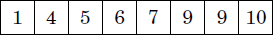
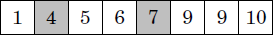
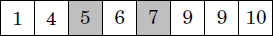

# **Arrays**

An array is one of the simplest and most fundamental data structures in programming. It stores a fixed-size collection of elements of the same type (e.g., integers, strings) in contiguous memory locations.

# **Properties**

* Same Type of Data: Every item in an array must be of the same type (like all numbers or all strings).  
* Access by Position: You get values using their position number, starting from 0\.  
   Example: array\[2\] gives you the third item.  
* Stored Together in Memory: The items are kept side-by-side in memory, which makes them quick to access.  
* Harder to Insert or Delete in the middle: If you want to add or remove something in the middle, the other items have to shift around, which takes more time.

# **Array Operations**

* ## Reading

  To read an array value, we use the array name with the index of the value we want to read in brackets, like this myFruits\[0\].

  We must also use a command to write myFruits\[0\] to the console/terminal, so that we can actually see the result, and that is done a little different depending on the programming language.

  * Python:
    
    myFruits \= \['banana','apple','orange'\]
     
    print(myFruits\[0\])  
  * C++:
    
    string myFruits\[\] \= {"banana","apple","orange"};
    
    cout \<\< myFruits\[0\];  
  * Javascript:
     
    const myFruits \= \['banana','apple','orange'\];
    
    console.log(myFruits\[0\]);

* ## Updating

  To update a value in an array, we use the array name with the index position of the value we want to update, like this myFruits\[0\], and then we use the equal sign \= to store a new value there.

  * Python:

    myFruits \= \['banana','apple','orange'\]

    myFruits\[0\] \= 'kiwi'

  * C++:

    string myFruits\[\] \= {"banana","apple","orange"};

    myFruits\[0\] \= "kiwi";

  * Javascript:

    const myFruits \= \['banana','apple','orange'\];

    myFruits\[0\] \= 'kiwi';

* ## Appending

  To insert a value into an array, in addition to the existing values, we need:

  \-the array name

  \-a command to do the insert operation

  \-the value to be inserted

  When we do insert this way, the new value is inserted at the end of the array.

  * Python:

    myFruits \= \['banana','apple','orange'\]

    myFruits.append('kiwi')

    

  * C++:

    vector\<string\> myFruits \= {"banana", "apple", "orange"};

    myFruits.push\_back("kiwi");

    

  * Javascript:

    const myFruits \= \['banana','apple','orange'\];

    myFruits.push('kiwi');

* ## Insertion

  A value can also be added to a specific position in an array, using the index, like this:

  * Python:
    
    myFruits \= \['banana','apple','orange'\]
    
    myFruits.insert(1,'kiwi')  
  * C++:
    
    vector\<string\> myFruits \= {"banana", "apple", "orange"};
      
    myFruits.insert(myFruits.begin() \+ 1, "kiwi");  
  * Javascript:
    
    const myFruits \= \['banana','apple','orange'\];
    
    myFruits.splice(1,0,'kiwi');

* ## Deletion

  An array value is removed by specifying the index where the value should be removed from.

  * Python:

    myFruits \= \['banana','apple','orange'\]

    myFruits.pop(1)

  * C++:

    vector\<string\> myFruits \= {"banana", "apple", "orange"};

    myFruits.erase(myFruits.begin() \+ 1);

  * Javascript:

    const myFruits \= \['banana','apple','orange'\];

    myFruits.splice(1,1);

* ## Length

  * Python:

    myFruits \= \['banana','apple','orange'\]

    print(len(myFruits))

  * C++:

    vector\<string\> myFruits \= {"banana", "apple", "orange"};

    cout \<\< myFruits.size();

  * Javascript:

    const myFruits \= \['banana','apple','orange'\];

    console.log(myFruits.length);

* ## Traversal

  This is how to look at every value in the array:

  * Python:

    myFruits \= \['banana','apple','orange'\]

    for fruit in myFruits:

      print(fruit)

  * C++:

    string myFruits\[\] \= {"banana", "apple", "orange"};

    for (auto fruit : myFruits) {

      cout \<\< fruit \+ "\\n";

    }

  * Javascript:

    const myFruits \= \['banana','apple','orange'\];

    for (let fruit of myFruits) {

      console.log(fruit);

# **Algorithms**

Here are a few algorithms which are useful in solving questions related to arrays:

## **Linear Search**

**Linear Search** is the simplest way to locate an element in an array. We iterate through all elements one by one, comparing each element with the target. If we find a match, we return its index. In the best case, the element is found at the very beginning, resulting in a time complexity of **O(1)**. In the worst case, we may need to check every element in the array, giving a time complexity of **O(n)**. Since it doesn't require the array to be sorted, it's a good choice for small or unsorted datasets.

It can be done in the following way:

        int linearSearch(int arr[], int size, int target) {
               for (int i = 0; i < size; i++) {
                    if (arr[i] == target) {
                        return i;
                    }
                }
                return -1;
             }

## **Two pointer method**

In the two pointers method, two pointers are used to iterate through the array values. Both pointers can move to one direction only, which ensures that the algorithm works efficiently. Next we discuss a problem that can be solved using the two pointers method.

**2sum problem:**

Another problem that can be solved using the two pointers method is the following problem, also known as the 2SUM problem: given an array of n numbers and a target sum x, find two array values such that their sum is x, or report that no such values exist.

To solve the problem, we first sort the array values in increasing order. After that, we iterate through the array using two pointers. The left pointer starts at the first value and moves one step to the right on each turn. The right pointer begins at the last value and always moves to the left until the sum of the left and right value is at most x. If the sum is exactly x, a solution has been found.

For example, consider the following array and a target sum x \= 12:

The initial positions of the pointers are as follows. The sum of the values is 1 \+ 10 \= 11 that is smaller than x.

Then the left pointer moves one step to the right. The right pointer moves three steps to the left, and the sum becomes 4+7 \= 11\.

After this, the left pointer moves one step to the right again. The right pointer does not move, and a solution 5+7 \= 12 has been found.

This can be implemented in C++ in the following way:

    #include <iostream>
    #include <vector>
    #include <algorithm>
    using namespace std;

    bool twoSum(vector<int> &arr, int target){
    // Sort the array
    
    sort(arr.begin(), arr.end());
    int left = 0, right = arr.size() - 1;

    // Iterate while left pointer is less than right

    while (left < right){
        int sum = arr[left] + arr[right];

        // Check if the sum matches the target
        if (sum == target)
            return true;

        else if (sum < target)
            left++; // Move left pointer to the right

        else
            right--; // Move right pointer to the left

    }

    // If no pair is found
    
    return false;

    }

    int main(){
   
       vector<int> arr = {0, -1, 2, -3, 1};
   
       int target = -2;
   
       if (twoSum(arr, target))
           cout << "true";
       else
           cout << "false";
           
       return 0;
   
    }

The running time of the algorithm is O(nlogn), because it first sorts the array in O(nlogn) time, and then both pointers move O(n) steps.

Note that it is possible to solve the problem in another way in O(nlogn) time using binary search. In such a solution, we iterate through the array and for each array value, we try to find another value that yields the sum x. This can be done by performing n binary searches, each of which takes O(logn) time.

## **Binary Search**

We have seen in linear search that in the worst case, the code runs in O(n) time. However, if the array is sorted, the situation is different. In this case it is possible to perform the search much faster, because the order of the elements in the array guides the search. The following binary search algorithm efficiently searches for an element in a sorted array in O(logn) time.

The usual way to implement binary search resembles looking for a word in a dictionary. The search maintains an active region in the array, which initially contains all array elements. Then, a number of steps is performed, each of which halves the size of the region. At each step, the search checks the middle element of the active region. If the middle element is the target element, the search terminates. Otherwise, the search recursively continues to the left or right half of the region, depending on the value of the middle element.

The above idea can be implemented as follows:
      
      int a = 0, b = n-1;
      
      while (a <= b) {
         int k = (a+b)/2;
         
         if (array[k] == x) {
         // x found at index k 
         }
         
         if (array[k] > x) b = k-1;
         else a = k+1;
         
      }

In this implementation, the active region is a...b, and initially the region is 0...n-1. The algorithm halves the size of the region at each step, so the time complexity is O(logn).

To learn more:

[https://www.geeksforgeeks.org/array-data-structure-guide/](https://www.geeksforgeeks.org/array-data-structure-guide/)

[https://www.geeksforgeeks.org/quizzes/dsa-tutorial-array/](https://www.geeksforgeeks.org/quizzes/dsa-tutorial-array/)

[Two Pointers Technique | GeeksforGeeks](https://www.geeksforgeeks.org/two-pointers-technique/)

[Binary Search Algorithm – Iterative and Recursive Implementation | GeeksforGeeks](https://www.geeksforgeeks.org/binary-search/)

# Problems

Easy:  
[Pascal's Triangle \- LeetCode](https://leetcode.com/problems/pascals-triangle/description/) | [Solution](https://www.geeksforgeeks.org/pascal-triangle/)

[Best Time to Buy and Sell Stock \- LeetCode](https://leetcode.com/problems/best-time-to-buy-and-sell-stock/description/?envType=problem-list-v2&envId=array) | [Solution](https://www.geeksforgeeks.org/best-time-to-buy-and-sell-stock/) 

[Single Number \- LeetCode](https://leetcode.com/problems/single-number/description/?envType=problem-list-v2&envId=array) | [Solution](https://algo.monster/liteproblems/136)

[Merge Sorted Array \- LeetCode](https://leetcode.com/problems/merge-sorted-array/description/?envType=problem-list-v2&envId=array) | [Solution](https://www.geeksforgeeks.org/merge-two-sorted-arrays/)

[Remove Duplicates from Sorted Array \- LeetCode](https://leetcode.com/problems/remove-duplicates-from-sorted-array/description/) | [Solution](https://www.geeksforgeeks.org/remove-duplicates-sorted-array/)

[Majority Element \- LeetCode](https://leetcode.com/problems/majority-element/description/) | [Solution](https://www.geeksforgeeks.org/majority-element/)

[Summary Ranges \- LeetCode](https://leetcode.com/problems/summary-ranges/description/?envType=problem-list-v2&envId=array) | [Solution](https://algo.monster/liteproblems/228)

Medium:

[Majority Element II \- LeetCode](https://leetcode.com/problems/majority-element-ii/description/) | [Solution](https://www.geeksforgeeks.org/find-all-array-elements-occurring-more-than-%E2%8C%8An-3%E2%8C%8B-times/)

[4Sum \- LeetCode](https://leetcode.com/problems/4sum/description/) | [Solution](https://takeuforward.org/data-structure/4-sum-find-quads-that-add-up-to-a-target-value/)

[Subarray Sum Equals K \- LeetCode](https://leetcode.com/problems/subarray-sum-equals-k/description/) | [Solution](https://algo.monster/liteproblems/560)

[Search in Rotated Sorted Array \- LeetCode](https://leetcode.com/problems/search-in-rotated-sorted-array/description/) | [Solution](https://www.geeksforgeeks.org/search-an-element-in-a-sorted-and-pivoted-array/)

[Sort Colors \- LeetCode](https://leetcode.com/problems/sort-colors/description/) | [Solution](https://www.geeksforgeeks.org/sort-an-array-of-0s-1s-and-2s/)

Hard:  
[Median of Two Sorted Arrays \- LeetCode](https://leetcode.com/problems/median-of-two-sorted-arrays/description/?envType=problem-list-v2&envId=array) | [Solution](https://www.geeksforgeeks.org/median-of-two-sorted-arrays-of-different-sizes/)

[Split Array Largest Sum \- LeetCode](https://leetcode.com/problems/split-array-largest-sum/description/?envType=problem-list-v2&envId=array) | [Solution](https://algo.monster/liteproblems/410)

[Find K-th Smallest Pair Distance \- LeetCode](https://leetcode.com/problems/find-k-th-smallest-pair-distance/description/?envType=problem-list-v2&envId=array) | [Solution](https://algo.monster/liteproblems/719)

[image1]: <data:image/png;base64,iVBORw0KGgoAAAANSUhEUgAAAPwAAAAvCAYAAADHAafmAAAIcklEQVR4Xu2az2tb2RXH3x/wNlp6UQgEgRaGUkQWY7qwFzEzGCpDEMaTIBSTIQ5tcLKonRTHXcTJJgOpzUBSqBbjlaE1mUZT4hmsadOBujQJVWiC0Uxsxs5Eg61xHKEaO1b8vr33SbKlJ8k6V8/yffTeD2iRy4u/55x3v/fnM6DRaJTBcDZoNJr/X7ThNRqF0IbXaBRCG16jUQhteI1GIbThNRqFIBneMAz90z/98/iPAu0pCVATOExU0ZSFjFxV0aTi2chkFE0VTVnIyFUVTSqejUxG0VTRlIWMXFXRpOLZyGQUTRVNWcjIVRVNKp6NTEbRVNGUhYxcVdGk4tnIZBRNFU1ZyMhVFU0qno1MRtFU0ZSFjFxV0aTi2chkFE0VTVGsrQ1YzsYmkJGrKppUWhtZPoPU0xXkmugtbotm5fN452xsgJjmNjJLL/ByY6vMDDvYYG3pLXrCYppFrCyWvvoU4xdPI9z3IcLhc0jn6Zpi7CKbuGrHWf0zsel8/ACEc7XzjCESiSBy/iomP18Q7kvCmqzX5Jb+iti1C7buyORfkMqJ9SQRzUxqASs1//420vOf4tr5KCJ9fYgM38UXi1nXAy89Miqbj3FnIIJwp99OvG04gazzGQIiRStnZ3EaZ/1mU7pCmrsLiHUH0cM6RU+wjf3fNoxPfY2VrV3nkwcipMlIxy/Db/ZiIlnK7i2WpwdgdMeQEpMmsoH58R5HR7OwmfwEvb+8X9HaCHqu/O9P4qR5DKHY82LbO6wnRhGoyL0xdE3G5hNMnPwJzBCr5U4hY2t9DiOBYzg58YQ8uB2s+QaP71wsDGLhThhtV5HIVr+4C34/+qeX9utuLWG6/7gdmxsOiswVu6kYuiUYfir6s6YHGiHNzX9gPPibmi9LBCFNxp3uyg7JjfB6/jbOTn/D1hctwPoe8cEPHW2rSIyEMZJYrWxvAD1XPsgwMxg9zNy5vVZreRr9ponAyBzWiVMdXZMNMvM30W740DHxbzaMlpoLRjMCo0is15qJqyFrskmjtuE3YRphxFJbZW1bSMXCdk3cQIxMHCmGtzbQFQ4h2KSukGY2geHOSSTfEnteHYQ0WafscHbIVmOtI/nHB+UN2GHvtvf9u3gmmDs5V3v1xFdNjk7Pa97GthId9LqTNfcM1Ybu2AL2LZhBYjhYNfgcBFmznuF3v6nRXthatbH37+bdEyMT5+gN/w7ZR7fx5NHvm9YV0bTzO3ERE3+4jWtDA2yJNohEah1554MNENHkndIwghhOZOx/8cO0H9I/Itey/XsN7Nn9pL3UFl1RkHMtzarOGX41jkEfM7xvCPFVWqXJmsWtkekcUO0VTjv7O+0YjH9P2kOTNesZng1s1e0lwxvC/bocYmTiHLXhrddf40ZoyJUuXXMLyzNDCPTcxIPnq9iyLORzi2xv/XNc+NO3Qkaga3Iy7PlOXJ/9J2Z/dw4nzOLh2fEQXh+J6Quze8g3gOll8XmGnmsOyYke9vxxex9boLTk5jk7l7v1oWtaeJucZCsoA2b/NJZL5eRbt3YT1TN/fciadQzP+3B1+77h3ZzVECMTx43xOOSicaxXmL0cwuDMkitdsqaVwfzkKD7++w8VIz4/8DH8lxFP0y1P1uTwDmL8FJ1dZ3Bj7oU9s+dzLzB3oxfRqeegWcANWWbEXvjKDSEAPVeW1/IMBv0mzK7fslXTDjZSf8ZYtB+ngr4WGZ6RX8LMIFu+mx/g2v0FbLD63h87h75TJ7ThG+HGeBxy0ezZ9hI6LsXxir0gN7p0zdoUZiX60o8jpGkb3of3bv2r4sSYnyQb7Tcxv0lVbY7CiXVb02cIQrny67HUZxjvK5jtRHQSD79NFGbbKjPUR0yT5ZhbwL3x0wgWV08TD5/ioX2AuL+VagRZs47hGy3pV128ZmJk4rgxHodWtNJBi/N+uOxXVbj60DRRPC3mf7+yE7Tc8MxmZq2OxzuOwL62Kfb2sjX0iQjlauWw8jSJVGa71FBc0heW+a2pLxtkVv6Dx6nM/llMcUlfscxvAFmznuHZlqZ6FVPq6++XtYlDjEycozF8NW50qZqlu9musS8rPniJhY6xJf0wZtfoxqNqlrjg91VdS1mvZuC/9ABrxA7ZFHt72aMwfB5rs8PwG4X9tI19WNghdD3GoWsyibUHuMS2EYa5f0Zh3/0bHfYVJLW8ZM26hrcQMgM4O7O8r1k8yNT38A7c6JI1rTd4FvsV+m/9DenShzbWfxFge7+xuZdCJ/VkzSLpuevo8oUx8ag4C+VfYm7sA8ylSzNha9g7IT8Swxc/siluX5D/EcnYR/D7P0Ls2Ruy8Th0zdJAzgz/3sd4bG+PdhD1BxGNPRX6wo+sWdfwQGrqPAJd14vvdRuv4r9GwH8eUyna1WA9iJHRsVbiuLL39RnvIH50hs8gEhnAlfh3zsfrQi5aGVy7UvesrUl9V0KazPSpzz/BSLQP4TOnEWY5tv5ajrONteQ93BoqfVY7gJHJz5wPHT47LxC/0ovgL25j/jV9hi1HKFcri8Uv7tr15VeePMfkmvigJqTJl/SLX+LOyACr62mmG8W95OrhvlPrO1ZHfo0bwZkefr9v4njnqcKXd1fiWCl11uJnxaORPvTxT2tHY/hqyYuf1h4SBxatRaiiKQsZuaqiScWzkckomiqaspCRqyqaVDwbmYyiqaIpCxm5qqJJxbORySiaKpqykJGrKppUPBuZjKKpoikLGbmqoknFs5HJKJoqmrKQkasqmlQ8G5mMoqmiKQsZuaqiScWzkckomiqaspCRqyqaVDwbmYyiqaIpCxm5qqJJxbuRaTSaQ0cbXqNRCG14jUYhtOE1GoXQhtdoFEIbXqNRCG14jUYhtOE1GoXQhtdoFEIbXqNRiP8BunSvTRra138AAAAASUVORK5CYII=>

[image2]: <data:image/png;base64,iVBORw0KGgoAAAANSUhEUgAAAQYAAABDCAYAAAB+16tXAAALY0lEQVR4Xu2dcUwUVx7H91+T9Q/iP0ejjRezF/4gqWbDxdrLKWfY1JKKdw2xoCVIbaQpjXoXoBrxkhb54zg1kPPq5dzciReDUaInFotlNaYGk7NGzEnI3ikJUmmUIhKKKMh+b97sDDs7s7u8eeu86d7+Pskvkcd78/M7b37feW9mbD0gCIIw4TE3EARBkDEQBGGBjIEgCAtkDARBWCBjIAjCAhkDQRAWyBgIgrBAxkAQhAUyBoIgLJAxEARhgYyBIAgLZAwEQVhIyxg8Hg8FBcWPPEQQG6XBkl65ckV6ZAuik5oOlNM53KgXUZ1iozTcEMoiWxCd1HSgnM7hRr2I6hQbpeGGUBbZguikpgPldA436kVUp9goDTeEssgWRCc1HSinc7hRL6I6xUZpuCGURbYgOqnpQDmdw416EdUpNkrDDaEssgXRSU0HyukcbtSLqE6xURpuCGWRLYhOajpQTudwo15EdYqN0khLaM85nAieQpe5nSPSJTI7ixfmxpfKMwyPTyMS1zaD8cG7cS0LITKpg5ePo/HjLSjdXI7S0u1oCPZiZDb+b5IK/pxzmAjtQa7H+t7c4/Eiv7EXU+YhSeDPqRGZUHQG0bCjEhU79qD1wgAm+SWq2M6pXDGTg1cQbPgQFRXVqG/9AuFJe1cRf71cwrkTx3GqK5Twd2eOfIKKt99EoLAQgbLfJugTC/s6o4iN0uAXqkcPus6cwNGD+/B+4QosKTuEC5Y+C4c40xjq2InX6kKYMP/qZRIZVM+N11+MrRUVyoW0FaXr8uCr7jD3TIntSZ0dRk7hp/hy6AfFlCJ43teKNZ5lKGq5ae6ZFP6c0wgHS+FdtwtHgn9Gc3NzNBo/RrHvN2jp4z/D/DkVIk9wJ/gBfHm16HzwDLNj19BclIfCA1/jsQ1zsJWTmcKdv6PStwa7OoeU8/wQvc0lyrn+A3of85sDT730dJ1Bw/vrsXTJFhy6EDL9XjGFg1VY9dN30XT6kvrz6aZ3Ufe3TlO/WNjTGUNslAaPUGPsfiuAQKAIa1cuVcfKNYYIZu61Y5vPi1ynjWFuAMWKIRT7cxWdufBvrEFj29e4Pz1n7pkSe5M6g5HO3YaCfI6h9ip42R08EIzrmQr+nOO43liMsvZBw8oogqm+P2HTR+cx4kiRsuO3osi7HCXBfkUx4wXGQvuQ593knBlN3URL0TJ4S4IIz0SFRcZ6UJ+3XDVdOysj87Uci04c3f1rpT4CeIXNWQJjuHzmAEqWLsWv9p/EZb398kkseqMObV+ZjxcNWzoNiI3SSC00eYRO1KJAtjFM96OtcpX6d3bcGKZ6EZqYM7faxtakPr+NzwPL5i9cVjCPrx/GxhV+bGv/T1zXVHDnjHyLzupypRgnDW0PEaovRX3ooWkblRrunKoZrVP6F8fljQy1o8zrRV59D8Y4E/PnVMzoehPyPTlY03JLsVu9eRDtZSvgyduH0BjfqoG3XmoLliQ0hrba9VjkWYvaE92G9m7luKtRc6wrrq8e/DrjERulwSvUHNKNITKOvtYtKCwtgV+GMUyE0Pec8wpNAf+k6tuGnNiFKwh3zsgY+k5fRP+UrlNZkYWD2PTmUdyxqZ07p7ISCwbYKqwUwfB0rF0533W5yl12TSv3eefOqW2Z2MovEBzA3Hz7KEJ1fotJpYK3XpIZw95f/CRBewhLPIuRX/NXXEpwLH6d8YiN0uAVag7ZxjBx4zACJUdw88ZfEJBgDHNKgbQcO4yGnVXqg6q65n8gFB7DrLnjAvBPqn7x+tWfItPj+G7ke0zaeOiow5/ThLpaKDIs8fnhzqnfpc0rhoedqM5RjCFnJzof8p1l7pzzWzLzioGtmPKV4+SjuvNbrhUSb70kM4ayJYm2GMwYktcSv854xEZp8Ao1h1RjiDxAdcegWpSsYB03hsgorrfui79QtD2qx7fb2Log3JM6fyd9DQd67qqGMDt5Fz0HNikX9CpUtvWbRySFO6eJvpZNyClrxxBPhZjgz6noGupAtc8Lb+HvcV4x2/HwP7G/sgzv+HNgWUmkgD+nwuwgOqqV1YF3AxrOD2B2fADn92/H5ncKYF1JJIe3XpIZA6sZa3vUGDwFtTgRsh7Llk4DYqM0eIWaQ54xsLcQu/BAu3NKMYaETCqFU6zeXezUDfekzhtDTtyDsOgDMi88+U2G1tRw5zRRn5cbf0e1gb2cLzAZPofGzQXqg9WCylZc/W8IjfmKztw93M927OVUzuXkAM42boHf64G3YDtart7GVfV5hx91oVFz94Tw1ksyY0i1Yli8sQlnExzLrk4dsVEavELNIccYom8hqkqa51ukGEPkCfo7/ohvRo1L2tg+dc7QuhD8k6rvd6NbiXkMe3Je+HMamYXPxpLajGjOydHv1Hz6VsJrY8UilpOtxL7HtJpU20p4q9A+xGeHvPWSzBhq8hcnaO/BYnrGEA0+9GI0f3wTC967ix2iT8g9pruIwyuG+X1wEmNQ9t688Oc0oBSJnTunGVs5I5O4f7sP4dFneoP21mCF6dVpamzlZKuU+//GN+HR2HOiqV51lWLXjMzXcqJIZgzHalYrx0j0VuLnqD56Ia6vHvZ0xhAbpcEr1BxyjMGKjBWD/n477mvDmX4ES5bD46uLtXFgZ1IjI+fxoS8n7nVd5EEHtuV44dt1Mda4AHZyzqMUiRxjmMWjL+uU1YlhdaA+9Fxj67Uhgz+nkuLRRezyeQ2rA+3bCc8aW69meeslmTF81VaHNxa9ig2fttN3DIlCFBnGEP0yrwYj+sdMkR8wdPZ3yPNuwP6e4fi+C2BvUp9hpOcztNzQ7mqzw+jZvwE5hZ+hZ0S/uy6MvZxR2FJejjHoBZmD15v/pT5P6WNfQfo+QPDOE+4CZfDn1M1eMYbXlS3iVASP+4Ko9PlRGbxt61Ns3npJZgxXrnShbe/beHVVFQ6eiX35uLety9QvFnZ0GhEbpcErVI/yAPvycT1W/2yJOtbjWYqVa4tQ3mRwQI6wS+R+Jz6pKNe+RGR5fVhXus3WhWQLxRzqKzejdOsWlJZuxc7G4w6/rtR5huad+r+TqEJ96zn0PeI3BYb9nAozd+HfeBjXbXwebMRWzsgE7nUf1c5vhZBGhq2cbCtx7xI+r69SzusW7Khvxdm+h0Lzab6W5+NyO5rK31K/fFykXqOL8MrKX6o/B8qbcOqy3vcLnDxUh/cChShk/1bivTrrsQxhT2cMsVEaKYU6GNmC6KSmA+V0DjfqRVSn2CgNN4SyyBZEJzUdKKdzuFEvojrFRmm4IZRFtiA6qelAOZ3DjXoR1Sk2SsMNoSyyBdFJTQfK6Rxu1IuoTrFRGm4IZZEtiE5qOlBO53CjXkR1io3ScEMoi2xBdFLTgXI6hxv1IqpTbJSGG0JZZAuik5oOlNM53KgXUZ1iozTcEMoiWxCd1HSgnM7hRr2I6hQbpcGSUlBQ/LhDBLFRBEH8X0PGQBCEBTIGgiAsSDeG4eFhFBSw/ySWBx0d9v4/CwSRjVy7dk2tF1Y7spBqDLopMENgQtmfu7u7zd0IgtDQTUGvl3A4bO7iCFKNwWgEugOWlJTg6dOnpp4EQdTW1s6bAasXZhLs5+PHj5u7vnSkGsPY2Nj8n/XXKMwUyBgIwgozAr029HphNXTr1i1jN0eQagxGRN+vEkQ2Irte5GYzIFsoQWQysutFbjYDsoUSRCYju17kZjMgWyhBZDKy60VuNgOyhRJEJiO7XuRmMyBbKEFkMrLrRW42A7KFEkQmI7te5GYzIFsoQWQysutFbjYDsoUSRCYju17kZjMgWyhBZDKy60VuNgOyhRJEJiO7XuRmMyBbKEFkMrLrRW42A7KFEkQmI7te5GYzIFsoQWQysutFbjaCIDICMgaCICyQMRAEYeF/GvtXEELwjHoAAAAASUVORK5CYII=>

[image3]: <data:image/png;base64,iVBORw0KGgoAAAANSUhEUgAAARIAAABHCAYAAADLA8jTAAALtUlEQVR4Xu2bUUxUVxrH59VkfCA+kdiNhkwzDyTNZkJiwU1hG0ktCXZjCQEJQaQRUw00DWAbYRMFHtQlC9roxkyidu1iLKVhbARlsG4T3ezaiFkNma2SAi0GEdFMEQWZ/95zh4GZy8xwzz1wT8L5fsmJcO79/HO/+93/OXPuGQcIgiAEcRg7CIIgeCEjIQhCGDISgiCEISMhCEIYMhKCIIQhIyEIQhgyEoIghCEjIQhCGCEjcTgc1KhRW0PNKtYjETYSWTDt69ev295kXrMsVMy1LG1ZugwRbeuREBMWRcXiloWKuZalLUuXIaJtPRJiwqKoWNyyUDHXsrRl6TJEtK1HQkxYFBWLWxYq5lqWtixdhoi29UiICYuiYnHLQsVcy9KWpcsQ0bYeCTFhUVQsblmomGtZ2rJ0GSLa1iMhJiyKisUtCxVzLUtbli5DRNt6JMSERVGxuGXBnese39I+C01mrmVpy9JliGhbj4SYMGbHEbg7jGDIeMAc3MUdr/X2Lu1bpvFf80uMDz5A7GXOYFLrG522ePE8hJ5jsO8cGg/sQkFhMeq9NzE6y6fLl2s/Lrfs0mOWtnXYvOckriyJid/4c4356/Wifm8ZSktL0XZ5wFKN8Wu/RnDwOrz1+3Td0tJK1LV9h0DwtfHEpPDparUVGMBwXI2XGL11LpyHwkKU1p5Gz8PnhjqMhU87FuuRsCo8i+BoAI2FbyG11o/nxsMm4StuY+vBxcM7kVbUEudY8sZ9zaFBtBelwenJQ4leYCUoyHbDVdmBIc4HmpvZEfQ2bEdKzmF0D/2mFVEImY43sK31R0wZz00CX6578GXNO6iuqUZlZeVi2/MnbNn4B+w/czlOTPzGn+tnuOf9CC53DXy/vmQdOLbNjZymH/CUM9W82sF7Z1HmykS1b0ircI3ZMdw8tkPL/VHcfBrvQY/P8rohzAZHEbh9Df9oLIYr9TP4n88ZztFMpPcIctIjeXiJX301cLs+gvfeM8O5iyyvnRjrkbAgPHUbp8rDDxOLlWUk1y40YPvGddhgh5HMDcCb60GeJ1WLTYUnfz8az/+A4ek545krzAxGfZ/A5fwArf2RLL+CU/v7HbleBDjk+XLtwxd7tqAvpq8P3WeqsPWDJnzdZzw/cePLdQhT/W3Y5tyEHd772tWHmfAfgjsmB+bg0wZat70B5w4trzOLjhWa6EWde5Nu3GZJrvsMt08dCM94CrKRxu5lHCMJjXZhn8uFovbBxRlIZEDT/sZEJNdOjvVIiAnnyjKSnrP4/D2XHm+LkUzdRKPnc2Pv6vPqLk7lGov7NfLTPNjd/r+FB80MfLm+hOb8dw1936Cl6B0UtXwT5/zEjS/Xk7jVmK3F5GmmEVzoDQ21o8jphLuuFxMcsxI+7RDSHSnIbL2jWXV0d/jhdbgPRfcmxbSuPkClxjGSKQS8xdqAUQBvYDqqf1rrL9DzkwjT2nGwHgkxYfuNxI/vTn+MjKxq/O30p8iwyUjmAl7kZhxAfVW5/rm59tjf4Q9MhKe/q0akaDyo9Y/rPaHpSTwafWI4zxz8uY5uzEQ8yKo5i2tLjiVvXLmOPLRGIxnzoTJFG7lTquAbM591Lm19phfPSH6BrzJd+7/Sk65NRGNaN5GRPPejNjXeTGVOO/QZUrX/P9EzZ1o7DtYjISZsu5F0taEiaycaLnTD/2WNTUYyjaGOKrjzmjEdYp9tH+JG227t48ZW7Pv6J65ZAR/j8Nd6tL81G0e6/4Xuv1Ygwxle8Kxr78dTzrUZ7lxHtWvna5G1/n00XLy65NhyjS/XQfS35mkxaTFT+qlbzdpsgV27cYRODp82W3tywFnUjqHo1LLZaLoT7CPtXFR3MkzrJjASfeBi15vESBJ9rDWtHQfrkRATttVI+i7haEEW8g9/hV7td9uMJDSOW22HcPyfjxb7pn7UP087XJ/AN7pKVhIpMsdbyM4pQVPvAwRnmZE90EbO36Ps/H2Yf6Q4cx3TLuPM/q1Y/8cGXORYG4k0rlyzRcihDlS6nHDm/Bld+qxvBg1lRdjpSVllIwE6KjXjdm5HfdcAJlmuJwfQ1VCBwp0ZZCTLISJsn5GwNzQfIv3DZlzqDffZZiRxiYyc6aj0/WJ6ysvFgpGk4O1j/455Q1Pn1kbI9GbcmjKvbD7Xhtb1FxT9bgPS95/BVeMxE40/168RDHyLxsKM8KKy9gDf+MkfnhUsebCSw6sdCg6gs3EXPPMzP2dGBVpv3MUNfd3GYzw9IaZ1ExiJmY82YwluvWntOFiPhJiwXUbC3tC8n1WJk12Le0ZsM5LQM9zvOI76pq+iOiPrF6nI9Q5gLurIyhH5aLO4RhIhbDD8o7MxD8u3XnQeLcJGx2bkN1+Kc3z5xpXrGGYRHH+ER5PTC2skSz52LIM1bTbre4LRR5PQtwhF1kic5cYTE2JaN5GRvLqD1syUpf1aTsZ8VUjRBpeYdZwoTGvHwXokxITtMhK2p4Gdm7Bt2IWWy/4lcYkazzWH3xgwnegRyYYZiVYqQ+3l2qicwEgsLDwa87B8Y29vNmuxb6Ko5ds4x5dvPLnWCQUxfLcfgXG2dyJMeI0kdt3EDLzaweH/4nZgPHYRfX6NhJmYWUzrJjKShfoyDhaRAey9qL5YTGvHwXokxITtMpJ4za4ZSWQfQU7D1cXOmfvw7tgEh6sW3Y/NP8y8hPcSpCx57bk7xQlX9RU85niqLOX6ykns2bzORiOZxePuWrgcsbMPf12m/vrVP2F+UxiDTxuodjn1mUf7UGS8fx3ew+LIRJ1/LObcZJjWTWgkIcwEvNjhdGN3xxDtI1kOS8U93+wykvBOy/0oOvb9/O+/YajzU7id29HQO7LKr4DndzemFKD1P/Mj5ewIUnKOoHd0ccQ2g6VcdzYjfz2bjdllJJEHN2pdaPYJXPO7OTl8U4dPe37t6e3juK2vPc3gab8XZS4Pyrx3ubbom9ZNaCSMIALn98K9cK8jO1v34nxg8dW4EdPacbAeCX7h0LAPB/Vt4sV6rMPhQnZBifZ7OQ76fua62VaKu+9iM4pz38WWNzfM629EcXO7YRdm8sZ7zcxMApdPoqBkFwq0a61qPGfDPpIIL/G4vxPHqsLfsykoKEf/Yz4TYVjJ9fVrF9BcvBVvZn6ML6LWp3gaf66f42HPadSVFWr5Dn/fxcr1Mni1gw+v4lRduZbjXZpuGfbWtaGzf4z7PifVDf0M30G2H6kUJXme+QVlJ9Kyd4Z3ux70RZ0b/s7RodJCFLLv2hzyom9wTX3XZmWwVNwr0GResyxUzLUsbVm6DBFt65EQExZFxeKWhYq5lqUtS5chom09EmLCoqhY3LJQMdeytGXpMkS0rUdCTFgUFYtbFirmWpa2LF2GiLb1SIgJi6JicctCxVzL0palyxDRth4JMWFRVCxuWaiYa1nasnQZItrWIyEmLIqKxS0LFXMtS1uWLkNE23okxIRFUbG4ZaFirmVpy9JliGhbj4SYsCgqFrcsVMy1LG1ZugwRbeuRBEEQ85CREAQhDBkJQRDCKGckd+7cQUVFBV68eGE8RKwwLMcZGRkIBALGQ8QaQykjGRkZ0QubLSqdOHHCeJhYYWpqavRcs5yTca9tlDGSiImcO3dOL242KyEzWT2ampr0HEdMm/08MTFhPI1YIyhhJB0dHXpBs38Z7Gc2QrIRk4p75WEfZVhuWY4jrxSZgTMj7+npMZxNrAWUMBJmFtGGEf2+nKbcK090TqNzbbwPxNpBCSMxIrLxhuCDcq0GSt5lKm77oFyrgZJ3mYrbPijXaqDkXabitg/KtRooeZepuO2Dcq0GSt5lKm77oFyrgZJ3mYrbPijXaqDkXabitg/KtRooeZepuO2Dcq0GSt5lKm77oFyrgZJ3mYrbPijXaqDkXabitg/KtRooeZepuO2Dcq0GSt5lKm77oFyrAd1lgiCEISMhCEIYMhKCIIQhIyEIQhgyEoIghCEjIQhCGDISgiCEISMhCEIYMhKCIIT5P1MNRbX6Xc6sAAAAAElFTkSuQmCC>

[image4]: <data:image/png;base64,iVBORw0KGgoAAAANSUhEUgAAAQ0AAAA6CAYAAACqGgypAAALNklEQVR4Xu2ab0xU2RnG5yvJ+IGYNEvDmjVmzHyg2d0QUhe3UWwgtSag2VKCWhb/RUwx0g/A2ipNFUmqu+xC1uxu3ElFq4VdUZexCjKDMTXaVIyYuiHTrqToikFEJFNEHZmn984fmDkz95w5Q+8949zzS95Ez3vnPDz3nvPec8+9FkgkEgkHFrJBIpFIaMiiIZFIuJBFQyKRcCGLhkQi4UIWDYlEwoUsGhKJhAtZNCQSCRdJFw2LxSJDhow0DRr0LAVWx3oiWvvSpUtCwoy+RXsWRSpr07MUWB3riWhtcmAbFWb0LdqzKFJZm56lwOpYT0RrkwPbqDCjb9GeRZHK2vQsBVbHeiJamxzYRoUZfYv2LIpU1qZnKbA61hPR2uTANirM6Fu0Z1GksjY9S4HVsZ6I1iYHtlFhRt+iPYsilbXpWQqsjvVEtDY5sI0KM/oW7VkUqaxNz1JgdawnorXJgW1UvDK+e5w47eyJbU8iRHsWRSpr07MUWB3riWhtcmDT4yLOnjyBr6ImUS+cStupnr44x2tHUr79kxjqa0Pjzg0oLVuP0tKt2Ou4ihGfnzySCo/vc80bsNAS+8FQMDKweMunuBDnd/Eiec8O7N1eiYqKClRs343Wc4PkUUyS0sZLeIcuwbF3R0C7vvWv8Hhfkgcx4dN+hjHPIO7G1XmGkWttwXNRVoaKus/Rc2cStKvP0qZnKbA6ZuIbg+fWXXhpf70G89ZW8Pt8iHeKWfBMnkD0nUTDqh8GfldYVISiokKseGsRsov3ocMV53hKJOPb1bAamQX70D38X2Wg+PF8oBX5ltdR2HIDU+TBFHh8H69dgYy3foGa2hpUVVXNxZZ1WJb9E1QfORfzG63g9ux/gtuObbDZa+G8/0xtgG/8Cg4V2vGYc6xxa6sF4/ZRVNryUeMchk9puXqoRDn/B3H1Md9oY2srvrwj8PT34i+N62HL2g335AxxjFIwXPtRkBM+F89w31kLu20bHLefEMfOwdKmZymwOo6PD94RD/pdJ9BY9iay6tyYJA9JgOS0I5nGm/PQJgc2NdxtqM1bimVKwbBYFmJp/jps+W0rOnrcsccygt/3C9isa9EyEHb6HMPtm2FV+rEUOeCZiTqYCo/vw1uWYVXDSfRFtfeh+8guvLv2AE71xf5GK/g8+zGlFMVC6xsocXyruA/zEuPuPRHnITH4tBWmbqCl8HVYS5Rz+yJYofzjLtTb30iqSGvzBP2f7QyuokpXYol6PeMUDf9IF3bYbChvH5pbWfiH0F6+JPA3akHXNrJoTPXjs82KyYqNKF1pC/xeTNHw48Wd9nlpkwObGhc+xZalG9F8zh2b4wxu389vRQ1gdfI8vvYxipfkYlP7vyImFRse303FP0X1l+eJ9tNoLl+B8ubTMcfTgs/zBK41rlR+s0YpEN6ojH+4HfZ6F8Y5Vht82krButaEHEsm8ltuKuU53BycpBb7HrjHE19tJKw9MwhHUVacojEFj2O9coMohcMzHdE+rbSXBs6RFixtepYCq2MaMx4HikQUDf8EBlo3oKC0ZF7a5MCmhft4LfLs61Bd+2vl0aQY5VW/Q/PxLrjiHMsKPt/BwVHnHgv8zz89gQcjj+Dl3MsIw+s7OtSCkYvltUfRG5OjB5fn8ASNVzRGnbBk7oJzVH1oSAwu7dlVHFk0voezKkfpKwdVzu+pewmRJKytVTQm3ajLircCmVFSu5Gl9K81/lna9CwFVsc0xBSNl5i8/jGKSg7jxvUv5qVNDmzt6EHHvvewaNlW/PHoGbjOn0DLztXIzvgRSv7wZ30nEMbgrsvF/u6/o/uTrcizhjYil5Sgvn0AjzmLB5/v6Og9VoflC36Oho6LMTlW8Hn2YqBljfKbJdFL8tAqwBJz16XDpx3eL7LAWt6O4bD41FU05liVvrJQ5BjETNRvtElYW6NohOcY2R5ZNLQeT1na9CwFVsc0RBQN/+O/4UDJLrTfmQroz0ebHNjacRaHd/4KO1o6557vu79Ade4PYMkuRdOp3ji/0Q4u36HBtLJgIw64vgusMHze7+A6sFa5G76NymPfIvHpw+s7Ms7hSPW7WLCqAR0cexnh4PKsbg4Od6LKZoW14Pfo8ozDpzyETXi+QUNluc5FQ8E3hM6qXFisq7G3axATyjnvatiKsvfyZNFQYXVMw/Ci4b+P7t+UoKpzKLCjbVzRiBfn8WX1MqWfxShu+jpOXju4fIcG0zuH/hG1ARfcmFPufDlNuDaV+Gojad9dH6F80ULkVB/BRTKXQHB5DvASXs9ZNJblBTd8lcmaV9mKy/92x5lAdPi1lfPrHcSZxg3IDa3sWi7fwuXAPkvu7KNiIiSsrVE0Enk8GdW4/CxtepYCq2MaxhaNaQx31iC/xon7oSW5cUXDiT/t24GKrXvw+VlXqK0n8EpSfZOSV9sGd8xvtIPPd/DxJGaghgdZEndd8u9hhwtnDpYjO4kCGQ4+z5H44B17gAcT04HHFHVPI+qxIQGS11ZXdY8w8mBibk/Duhntw7M7HUwS1tYqGs9voiU/M7ZdOS+jzl3ItGTO7bsQsLTpWQqsjmkYVzSCb0o2lxyKek9uVNHo62jAqgz1jrMU5c1nQ+0GrTRCG3OaRSOJTUHy72HH12gqXkz45ws+z1Bv9bh7awCeMfW7hNnGwJ5G9D4HG25tdZVz95/o94wFVrQBQnsauhUsraIxu79D3hzCb09+FtEWDUubnqXA6piGcUUjfIIiv0gkIuZk0+GaPIGl+Wt4+/0PccoVaus9itrlr8GSXY6DZ8Krj8Qicd9B1Pf05GtG//1ObMq0wlZzAQ85BzH59zBDfd28OAPGFQ0fHnbXwWYhNiP9o3DX53O98lTh01ZkHl5Ajc0atapQvw+xW/JR7x7Vp2BpFg3lhqnMsxKrHZs6h+e0Q2+YXo3vNCIwrmjEx6iVRuDxpG4dVlV9glOBj7kuoH3/L7Eo48d4/6OvuF+78vt+hoLMUrRcD935fPdCX4juh2sk8k7Mhs93KM40oXgBudLiCz7PwY+47MrSe3Yvx/cIA+oXorZtXJNWhU87Yr/onQ/RH9gveoFKWy4qHbe4v3xOWFuzaKh44Tm2HfbZ6x3+InQ7jnmiX0lHwtKmZymwOibx33XiA/ULtor1WJOrPlOrg8mGlaUblbbNXBeUVztM8G8I66vam/CB8z/c2uTANiqS9f3/QJRv0Z5Fkcra9CwFVsd6IlqbHNhGhRl9i/YsilTWpmcpsDrWE9Ha5MA2KszoW7RnUaSyNj1LgdWxnojWJge2UWFG36I9iyKVtelZCqyO9US0NjmwjQoz+hbtWRSprE3PUmB1rCeitcmBbVSY0bdoz6JIZW16lgKrYz0RrU0ObKPCjL5FexZFKmvTsxRYHeuJaG1yYBsVZvQt2rMoUlmbnqXA6lhPRGuTA9uoMKNv0Z5Fkcra9CwFVsd6IlqbHNhGhRl9i/YsilTWpmcpqB3LkCEjPYMGPSuRSCQEsmhIJBIuZNEwkCtXrpBNpqCnpwdPnz4lmyWvKLJoGIj6rGi2wnHz5s2A77a2NjIleUWRRcMg1GKhTp68vDzcu3ePTKclqk/Vb9i32QpmuiKLhs6oy/LOzs7ZyaNOHPXf6bxkV32p/sKFQvUdLiDqiiNdfZsFWTQMhPUqK10xq+90RV5NAzHr5DGr73RFXk0DMevkMavvdEVeTQMx6+Qxq+90RV5NAzHr5DGr73RFXk0DMevkMavvdEVeTQMx6+Qxq+90RV5NAzHr5DGr73RFXk0DMevkMavvdEVeTQMx6+Qxq+90RV5NAzHr5DGr73RFXk0DMevkMavvdOV/HLFtyXgaeCYAAAAASUVORK5CYII=>
