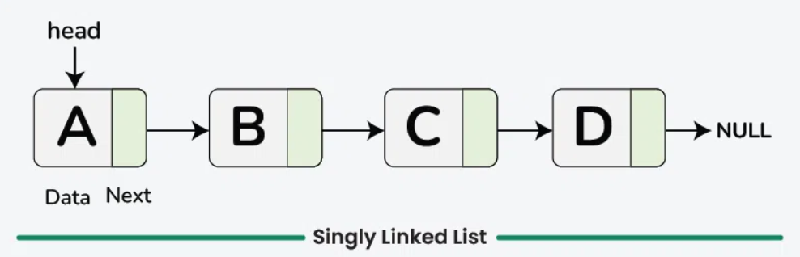
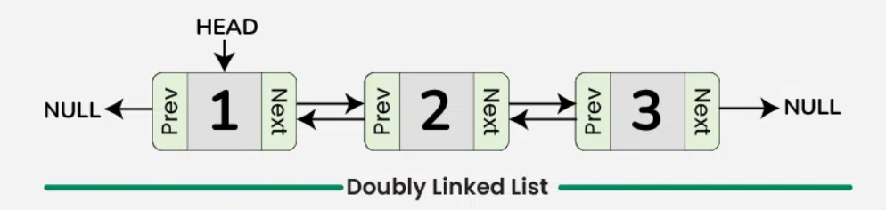
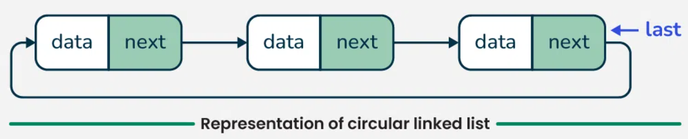
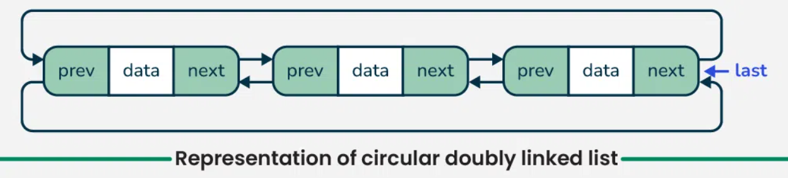

<!-----

You have some errors, warnings, or alerts. If you are using reckless mode, turn it off to see useful information and inline alerts.
* ERRORs: 0
* WARNINGs: 0
* ALERTS: 4

Conversion time: 1.034 seconds.


Using this Markdown file:

1. Paste this output into your source file.
2. See the notes and action items below regarding this conversion run.
3. Check the rendered output (headings, lists, code blocks, tables) for proper
   formatting and use a linkchecker before you publish this page.

Conversion notes:

* Docs to Markdown version 1.0β44
* Wed Jun 04 2025 02:20:54 GMT-0700 (PDT)
* Source doc: Linked List
* Tables are currently converted to HTML tables.
* This document has images: check for >>>>>  gd2md-html alert:  inline image link in generated source and store images to your server. NOTE: Images in exported zip file from Google Docs may not appear in  the same order as they do in your doc. Please check the images!


WARNING:
You have 8 H1 headings. You may want to use the "H1 -> H2" option to demote all headings by one level.

----->
<!--

<p style="color: red; font-weight: bold">>>>>>  gd2md-html alert:  ERRORs: 0; WARNINGs: 1; ALERTS: 4.</p>
<ul style="color: red; font-weight: bold"><li>See top comment block for details on ERRORs and WARNINGs. <li>In the converted Markdown or HTML, search for inline alerts that start with >>>>>  gd2md-html alert:  for specific instances that need correction.</ul>

<p style="color: red; font-weight: bold">Links to alert messages:</p><a href="#gdcalert1">alert1</a>
<a href="#gdcalert2">alert2</a>
<a href="#gdcalert3">alert3</a>
<a href="#gdcalert4">alert4</a>

<p style="color: red; font-weight: bold">>>>>> PLEASE check and correct alert issues and delete this message and the inline alerts.<hr></p>

-->

# Linked List


# What is a Linked List?

A **linked list** is a linear data structure where elements (called **nodes**) are stored in separate memory locations and connected using **pointers**.

Unlike arrays, where elements are stored in **contiguous memory**, in a linked list, each node contains:


1. **Data** – The actual value or information. \

2. **Pointer/Link** – A reference to the **next node** (and optionally the previous node). \

---

# Types of Linked Lists


1. Singly Linked List

    In a singly linked list, each node consists of two parts: data and a pointer to the next node. This structure allows nodes to be dynamically linked together, forming a chain-like sequence.
<!--
<p id="gdcalert1" ><span style="color: red; font-weight: bold">>>>>>  gd2md-html alert: inline image link here (to images/image1.png). Store image on your image server and adjust path/filename/extension if necessary. </span><br>(<a href="#">Back to top</a>)(<a href="#gdcalert2">Next alert</a>)<br><span style="color: red; font-weight: bold">>>>>> </span></p>
-->




2. Doubly Linked List

    In a data structure, a doubly linked list is represented using nodes that have three fields:

* Data
* A pointer to the next node (next)
* A pointer to the previous node (prev)

    
<!--
<p id="gdcalert2" ><span style="color: red; font-weight: bold">>>>>>  gd2md-html alert: inline image link here (to images/image2.png). Store image on your image server and adjust path/filename/extension if necessary. </span><br>(<a href="#">Back to top</a>)(<a href="#gdcalert3">Next alert</a>)<br><span style="color: red; font-weight: bold">>>>>> </span></p>
-->




3. Circular Linked List

    In a Circular Singly Linked List, each node has just one pointer called the "next" pointer. The next pointer of the last node points back to the first node and this results in forming a circle. In this type of Linked list, we can only move through the list in one direction.


    In a circular doubly linked list, each node has two pointers prev and next, similar to doubly linked list. The previous pointer points to the previous node and the next points to the next node. Here, in addition to the last node storing the address of the first node, the first node will also store the address of the last node.
<!--
<p id="gdcalert3" ><span style="color: red; font-weight: bold">>>>>>  gd2md-html alert: inline image link here (to images/image3.png). Store image on your image server and adjust path/filename/extension if necessary. </span><br>(<a href="#">Back to top</a>)(<a href="#gdcalert4">Next alert</a>)<br><span style="color: red; font-weight: bold">>>>>> </span></p>
-->



<!--
<p id="gdcalert4" ><span style="color: red; font-weight: bold">>>>>>  gd2md-html alert: inline image link here (to images/image4.png). Store image on your image server and adjust path/filename/extension if necessary. </span><br>(<a href="#">Back to top</a>)(<a href="#gdcalert5">Next alert</a>)<br><span style="color: red; font-weight: bold">>>>>> </span></p>
-->




---

# Creating a Linked List


## Step 1: Define Node Structure


### C++


```
struct Node {
    int data; // The data stored in the node
    Node* next; // Pointer to the next node
```


### JavaScript


```
class Node {
    constructor(data) {
        this.data = data;  // The data stored in the node
        this.next = null;  // Pointer to the next node
    }
}
```


### Python


```
class Node:
    def __init__(self, data):
        self.data = data  # The data stored in the node
        self.next = None   # Pointer to the next node
```


## Step 2: Initialise the Head of the List


### C++


```
Node* head = nullptr;
```


### JavaScript


```
let head = null;
```


### Python


```
head = None
```


## Step 3: Create New Nodes

To add elements to the list, we create new nodes. Each new node should be dynamically allocated using the new keyword.


## Step 4: Link the Nodes

If the list is not empty, we need to traverse the list to find the last node and update its next pointer.


## Complete Implementation

You should be able to implement a linked list now. Using the above steps you can create doubly and circular linked lists as well. Make sure to free the memory which has been dynamically allocated after you are done with the linked lists. If you have any doubts, you can refer to this [How to create linked list? | GeeksforGeeks](https://www.geeksforgeeks.org/how-to-create-linked-list/). 

---

# Traversal


## Step-by-Step Algorithm:


* We will initialize a temporary pointer to the head node of the singly linked list.
* After that, we will check if that pointer is null or not null, if it is null, then return.
* While the pointer is not null, we will access and print the data of the current node, then we move the pointer to the next node.

**Time Complexity:** O(n), where n is the number of nodes in the linked list.

**Auxiliary Space:** O(1)

Try implementing it on your own. If you face any difficulty, you can refer to this [Traversal of Singly Linked List | GeeksforGeeks](https://www.geeksforgeeks.org/traversal-of-singly-linked-list/). The implementation for doubly and circular linked lists are similar to this.

---

# Inserting a Node

Insertion in a linked list involves adding a new node at a specified position in the list. There are several types of insertion based on the position where the new node is to be added:


* At the front of the linked list  
* Before a given node.
* After a given node.
* At a specific position.
* At the end of the linked list.


## 1. Insert a Node at the Front/Beginning of the Linked List

To insert a new node at the front, we create a new node and point its next reference to the current head of the linked list. Then, we update the head to be this new node. This operation is efficient because it only requires adjusting a few pointers.


## 2. Insert a Node after a Given Node in Linked List

If we want to insert a new node after a specific node, we first locate that node. Once we find it, we set the new node's next reference to point to the node that follows the given node. Then, we update the given node next to point to the new node. This requires traversing the list to find the specified node.


## 3. Insert a Node before a Given Node in Linked List

If we want to insert a new node before a given node, we first locate that node while keeping track of the previous node also. Once we find it, we set the previous node's next reference to the new node. Then, we update the node's next reference to point to the given node.


## 4. Insert a Node At a Specific Position in Linked List

To insert a new node at a specific position, we need to traverse the list to position - 1. If the position is valid, we adjust the pointers similarly such that the next pointer of the new node points to the next of the current node and the next pointer of the current node points to the new node.


## 5. Insert a Node at the End of Linked List

Inserting at the end involves traversing the entire list until we reach the last node. We then set the last node's next reference to point to the new node, making the new node the last element in the list.

Try this out yourself. If you face any difficulty, you can refer to this [Insertion in Linked List | GeeksforGeeks](https://www.geeksforgeeks.org/insertion-in-linked-list/). 

---

# Deleting a Node

Types of Deletion in Linked List


* Deletion at the Beginning of Linked List
* Deletion at Specific Position of Linked List
* Deletion at the End of Linked List


## 1. Deletion at the Beginning of Linked List


* Check if the list is empty: If the head is NULL, the list is empty, and there's nothing to delete.
* Update the head pointer: Set the head to the second node (head = head->next).
* Delete the original head node: The original head node is now unreferenced, and it can be freed/deleted if necessary (in languages like C++ where memory management is manual).


## 2. Deletion at Specific Position of Linked List


* Check if the position is valid: If the position is out of bounds (greater than the length of the list), return an error or handle appropriately.
* Traverse the list to find the node just before the one to be deleted: Start from the head and move through the list until reaching the node at position n-1 (one before the target position).
* Update the next pointer: Set the next pointer of the (n-1)ᵗʰ node to point to the node after the target node (node_to_delete->next).
* Delete the target node: The node to be deleted is now unreferenced, and in languages like C++ or Java, it can be safely deallocated.


## 3. Deletion at the End of Linked List


* Check if the list is empty: If the head is NULL, the list is empty, and there's nothing to delete.
* If the list has only one node: Simply set the head to NULL (the list becomes empty).
* Traverse the list to find the second-last node: Start from the head and iterate through the list until you reach the second-last node (where the next of the node is the last node).
* Update the next pointer of the second-last node: Set the second-last node’s next to NULL (removing the link to the last node).
* Delete the last node: The last node is now unreferenced and can be deleted or freed, depending on the language used.

---

# Resources

Here you can visualise linked lists:

[Linked List (Single, Doubly) - VisuAlgo](https://visualgo.net/en/list)

Here are some resources to help you understand and implement linked lists:

[Singly Linked List Tutorial | GeeksforGeeks](https://www.geeksforgeeks.org/singly-linked-list-tutorial/)

[Doubly Linked List Tutorial | GeeksforGeeks](https://www.geeksforgeeks.org/doubly-linked-list/)

[Introduction to Circular Linked List | GeeksforGeeks](https://www.geeksforgeeks.org/circular-linked-list/)

---

# Practice Problems


## Easy


1. [Reverse Linked List - LeetCode](https://leetcode.com/problems/reverse-linked-list/) | [Solution](https://www.geeksforgeeks.org/reverse-a-linked-list/) 
2. [Remove Linked List Elements - LeetCode](https://leetcode.com/problems/remove-linked-list-elements/description/) | [Solution](https://www.geeksforgeeks.org/delete-occurrences-given-key-linked-list/) 
3. [Merge Two Sorted Lists - LeetCode](https://leetcode.com/problems/merge-two-sorted-lists/) | [Solution](https://www.geeksforgeeks.org/merge-two-sorted-linked-lists/) 
4. [Linked List Cycle II - LeetCode](https://leetcode.com/problems/linked-list-cycle-ii/) | [Solution](https://www.geeksforgeeks.org/find-length-of-loop-in-linked-list/) 
5. [Palindrome Linked List - LeetCode](https://leetcode.com/problems/palindrome-linked-list/) | [Solution](https://www.geeksforgeeks.org/function-to-check-if-a-singly-linked-list-is-palindrome/) 
6. [Intersection of Two Linked Lists - LeetCode](https://leetcode.com/problems/intersection-of-two-linked-lists/description/) | [Solution](https://www.geeksforgeeks.org/write-a-function-to-get-the-intersection-point-of-two-linked-lists/) 
7. [Middle of the Linked List - LeetCode](https://leetcode.com/problems/middle-of-the-linked-list/description/) | [Solution](https://www.geeksforgeeks.org/write-a-c-function-to-print-the-middle-of-the-linked-list/) 


## Medium


1. [Odd Even Linked List - LeetCode](https://leetcode.com/problems/odd-even-linked-list/description/) | [Solution](https://www.geeksforgeeks.org/segregate-even-and-odd-elements-in-a-linked-list/) 
2. [Add Two Numbers - LeetCode](https://leetcode.com/problems/add-two-numbers/description/) | [Solution](https://www.geeksforgeeks.org/add-two-numbers-represented-by-linked-list/) 
3. [Remove Nth Node From End of List - LeetCode](https://leetcode.com/problems/remove-nth-node-from-end-of-list/description/) | [Solution](https://www.geeksforgeeks.org/delete-nth-node-from-the-end-of-the-given-linked-list/) 
4. [Rotate List - LeetCode](https://leetcode.com/problems/rotate-list/description/) | [Solution](https://www.geeksforgeeks.org/rotate-a-linked-list/) 
5. [Sort List - LeetCode](https://leetcode.com/problems/sort-list/description/) | [Solution](https://www.geeksforgeeks.org/sorting-a-singly-linked-list/) 


## Hard


1. [Reverse Nodes in k-Group - LeetCode](https://leetcode.com/problems/reverse-nodes-in-k-group/) | [Solution](https://www.geeksforgeeks.org/reverse-a-linked-list-in-groups-of-given-size/) 
2. [Merge k Sorted Lists - LeetCode](https://leetcode.com/problems/merge-k-sorted-lists/description/) | [Solution](https://www.geeksforgeeks.org/merge-k-sorted-linked-lists/)
3. [LFU Cache - LeetCode](https://leetcode.com/problems/lfu-cache/description/) | [Solution](https://www.geeksforgeeks.org/lru-cache-implementation/) 
