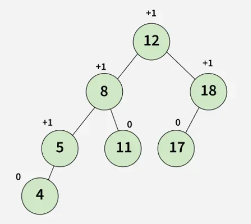
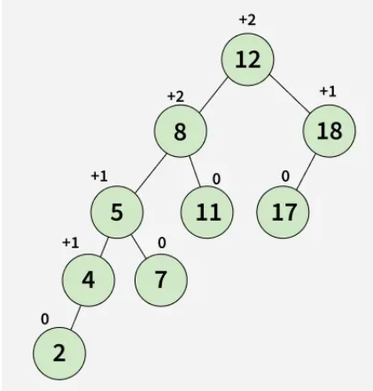

# AVL Trees

An **AVL Tree** is a self-balancing Binary Search Tree (BST) where the difference between heights of left and right subtrees cannot be more than one for all nodes. It is named after its inventors Adelson-Velsky and Landis.

Balancing is maintained through **rotations** that occur during insertions and deletions.

---

Example of an AVL Tree:



Example of a Binary Search Tree which is NOT an AVL Tree:


## Properties

1. **Binary Search Tree Property**:
   - For each node, values in the left subtree are less than the node’s value, and values in the right subtree are greater.

2. **Balance Factor**:
   - Defined as the difference in height between the left and right subtree.
   - `BalanceFactor = height(left subtree) - height(right subtree)`
   - Must be -1, 0, or +1 for all nodes.

3. **Height-Balanced**:
   - Ensures operations like insertion, deletion, and look-up all occur in **O(log n)** time.

---

## Rotations in AVL Tree

To maintain balance, AVL Trees use **four types of rotations**:

### 1. Left Left Rotation (LL Rotation)
- Occurs when a node is inserted into the right subtree of the right child, causing the balance factor to become less than 1.
- Fix: Perform a single left rotation.

### 2. Right Right Rotation (RR Rotation)
- Occurs when a node is inserted into the left subtree of the left child, making the balance factor greater than +1.
- Fix: Perform a single right rotation

### 3. Left-Right Rotation (LR Rotation)
- Occurs when a node is inserted into the right subtree of the left child, which disturbs the balance factor of an ancestor node, making it left-heavy.
- Fix: Perform a left rotation on the left child, followed by a right rotation on the node.

### 4. Right-Left Rotation (RL Rotation)
- Occurs when a node is inserted into the left subtree of the right child, which disturbs the balance factor of an ancestor node, making it right-heavy.
- Fix: Perform a right rotation on the right child, followed by a left rotation on the node.

---

## AVL Tree Operations

### 1. Insertion
- Perform the normal BST insertion.
- The current node must be one of the ancestors of the newly inserted node. Update the height of the current node. 
- Get the balance factor (left subtree height - right subtree height) of the current node.
- If the balance factor is greater than 1, then the current node is unbalanced and we are either in the Left Left case or left Right case. To check whether it is left left case or not, compare the newly inserted key with the key in the left subtree root. 
- If the balance factor is less than -1, then the current node is unbalanced and we are either in the Right Right case or Right-Left case. To check whether it is the Right Right case or not, compare the newly inserted key with the key in the right subtree root.


### C++ Implementation

```cpp
#include <iostream>
using namespace std;

class Node {
public:
    int key, height;
    Node* left;
    Node* right;

    Node(int value) {
        key = value;
        height = 1;
        left = right = nullptr;
    }
};

int height(Node* N) {
    return N ? N->height : 0;
}

int getBalance(Node* N) {
    return N ? height(N->left) - height(N->right) : 0;
}

int max(int a, int b) {
    return (a > b) ? a : b;
}

Node* rightRotate(Node* y) {
    Node* x = y->left;
    Node* T2 = x->right;

    x->right = y;
    y->left = T2;

    y->height = max(height(y->left), height(y->right)) + 1;
    x->height = max(height(x->left), height(x->right)) + 1;

    return x;
}

Node* leftRotate(Node* x) {
    Node* y = x->right;
    Node* T2 = y->left;

    y->left = x;
    x->right = T2;

    x->height = max(height(x->left), height(x->right)) + 1;
    y->height = max(height(y->left), height(y->right)) + 1;

    return y;
}

Node* insert(Node* node, int key) {
    if (!node)
        return new Node(key);

    if (key < node->key)
        node->left = insert(node->left, key);
    else if (key > node->key)
        node->right = insert(node->right, key);
    else
        return node;

    node->height = 1 + max(height(node->left), height(node->right));

    int balance = getBalance(node);

    if (balance > 1 && key < node->left->key)
        return rightRotate(node);
    if (balance < -1 && key > node->right->key)
        return leftRotate(node);
    if (balance > 1 && key > node->left->key) {
        node->left = leftRotate(node->left);
        return rightRotate(node);
    }
    if (balance < -1 && key < node->right->key) {
        node->right = rightRotate(node->right);
        return leftRotate(node);
    }

    return node;
}

void inOrder(Node* root) {
    if (root) {
        inOrder(root->left);
        cout << root->key << " ";
        inOrder(root->right);
    }
}

int main() {
    Node* root = nullptr;

    root = insert(root, 10);
    root = insert(root, 20);
    root = insert(root, 30);
    root = insert(root, 40);
    root = insert(root, 50);
    root = insert(root, 25);

    inOrder(root); // Output: 10 20 25 30 40 50

    return 0;
}

```

### 2. Deletion
- Deletion in AVL trees is similar to deletion in a Binary Search Tree (BST), but followed by rebalancing operations.
- After deleting a node, the balance factor of ancestor nodes may change.
- If the balance factor goes outside the range of -1 to +1, rotations (LL, RR, LR, RL) are required to restore balance.
- The type of rotation depends on the balance factors of the affected node and its children.

---

## Time Complexity

| Operation | Time Complexity |
|-----------|------------------|
| Search    | O(log n)         |
| Insert    | O(log n)         |
| Delete    | O(log n)         |

---
### C++ Implementation
```cpp
#include <bits/stdc++.h>
using namespace std;

// An AVL tree node
class Node {
public:
    int key;
    Node *left;
    Node *right;
    int height;

    Node(int k) {
        key = k;
        left = nullptr;
        right = nullptr;
        height = 1;
    }
};

// A utility function to get the height 
// of the tree
int height(Node *N) {
    if (N == nullptr)
        return 0;
    return N->height;
}

// A utility function to right rotate 
// subtree rooted with y
Node *rightRotate(Node *y) {
    Node *x = y->left;
    Node *T2 = x->right;

    // Perform rotation
    x->right = y;
    y->left = T2;

    // Update heights
    y->height = 1 + max(height(y->left),
                height(y->right));
    x->height = 1 + (height(x->left),
                height(x->right));

    // Return new root
    return x;
}

// A utility function to left rotate 
// subtree rooted with x
Node *leftRotate(Node *x) {
    Node *y = x->right;
    Node *T2 = y->left;

    // Perform rotation
    y->left = x;
    x->right = T2;

    // Update heights
    x->height = 1 + max(height(x->left),
                height(x->right));
    y->height = 1 + max(height(y->left),
                height(y->right));

    // Return new root
    return y;
}

// Get Balance factor of node N
int getBalance(Node *N) {
    if (N == nullptr)
        return 0;
    return height(N->left) - 
           height(N->right);
}

Node* insert(Node* node, int key) {
    // 1. Perform the normal BST rotation
    if (node == nullptr)
        return new Node(key);

    if (key < node->key)
        node->left = insert(node->left, key);
    else if (key > node->key)
        node->right = insert(node->right, key);
    else // Equal keys not allowed
        return node;

    // 2. Update height of this ancestor node
    node->height = 1 + max(height(node->left), 
                   height(node->right));

    // 3. Get the balance factor of this 
    // ancestor node to check whether this 
    // node became unbalanced
    int balance = getBalance(node);

    // If this node becomes unbalanced, then 
    // there are 4 cases

    // Left Left Case
    if (balance > 1 && key < node->left->key)
        return rightRotate(node);

    // Right Right Case
    if (balance < -1 && key > node->right->key)
        return leftRotate(node);

    // Left Right Case
    if (balance > 1 && key > node->left->key) {
        node->left = leftRotate(node->left);
        return rightRotate(node);
    }

    // Right Left Case
    if (balance < -1 && key < node->right->key) {
        node->right = rightRotate(node->right);
        return leftRotate(node);
    }

    // return the (unchanged) node pointer
    return node;
}

// Given a non-empty binary search tree, 
// return the node with minimum key value 
// found in that tree. Note that the entire 
// tree does not need to be searched.
Node * minValueNode(Node* node) {
    Node* current = node;

    // loop down to find the leftmost leaf
    while (current->left != nullptr)
        current = current->left;

    return current;
}

// Recursive function to delete a node with 
// given key from subtree with given root. 
// It returns root of the modified subtree.
Node* deleteNode(Node* root, int key) {
    // STEP 1: PERFORM STANDARD BST DELETE
    if (root == nullptr)
        return root;

    // If the key to be deleted is smaller 
    // than the root's key, then it lies in 
    // left subtree
    if (key < root->key)
        root->left = deleteNode(root->left, key);

    // If the key to be deleted is greater 
    // than the root's key, then it lies in 
    // right subtree
    else if (key > root->key)
        root->right = deleteNode(root->right, key);

    // if key is same as root's key, then 
    // this is the node to be deleted
    else {
        // node with only one child or no child
        if ((root->left == nullptr) || 
            (root->right == nullptr)) {
            Node *temp = root->left ? 
                         root->left : root->right;

            // No child case
            if (temp == nullptr) {
                temp = root;
                root = nullptr;
            } else // One child case
                *root = *temp; // Copy the contents of 
                               // the non-empty child
            free(temp);
        } else {
            // node with two children: Get the 
            // inorder successor (smallest in 
            // the right subtree)
            Node* temp = minValueNode(root->right);

            // Copy the inorder successor's 
            // data to this node
            root->key = temp->key;

            // Delete the inorder successor
            root->right = deleteNode(root->right, temp->key);
        }
    }

    // If the tree had only one node then return
    if (root == nullptr)
        return root;

    // STEP 2: UPDATE HEIGHT OF THE CURRENT NODE
    root->height = 1 + max(height(root->left), 
                   height(root->right));

    // STEP 3: GET THE BALANCE FACTOR OF THIS 
    // NODE (to check whether this node 
    // became unbalanced)
    int balance = getBalance(root);

    // If this node becomes unbalanced, then 
    // there are 4 cases

    // Left Left Case
    if (balance > 1 && 
        getBalance(root->left) >= 0)
        return rightRotate(root);

    // Left Right Case
    if (balance > 1 && 
        getBalance(root->left) < 0) {
        root->left = leftRotate(root->left);
        return rightRotate(root);
    }

    // Right Right Case
    if (balance < -1 && 
        getBalance(root->right) <= 0)
        return leftRotate(root);

    // Right Left Case
    if (balance < -1 && 
        getBalance(root->right) > 0) {
        root->right = rightRotate(root->right);
        return leftRotate(root);
    }

    return root;
}

// A utility function to print preorder 
// traversal of the tree. 
void preOrder(Node *root) {
    if (root != nullptr) {
        cout << root->key << " ";
        preOrder(root->left);
        preOrder(root->right);
    }
}

// Driver Code
int main() {
    Node *root = nullptr;

    // Constructing tree given in the 
    // above figure
    root = insert(root, 9);
    root = insert(root, 5);
    root = insert(root, 10);
    root = insert(root, 0);
    root = insert(root, 6);
    root = insert(root, 11);
    root = insert(root, -1);
    root = insert(root, 1);
    root = insert(root, 2);

    cout << "Preorder traversal of the "
            "constructed AVL tree is \n";
    preOrder(root);

    root = deleteNode(root, 10);

    cout << "\nPreorder traversal after"
            " deletion of 10 \n";
    preOrder(root);

    return 0;
}
```
To learn more refer to these:
- https://www.geeksforgeeks.org/dsa/introduction-to-avl-tree/
- https://www.w3schools.com/dsa/dsa_data_avltrees.php


