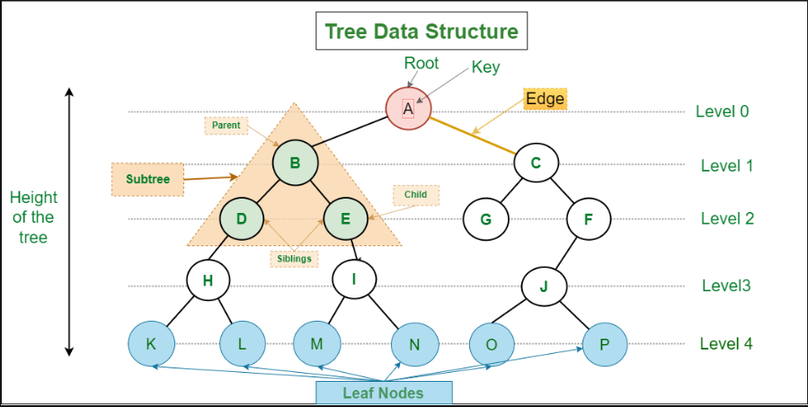
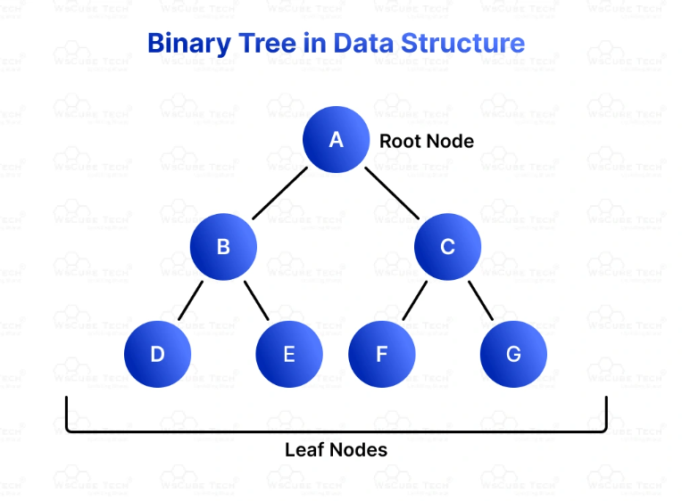
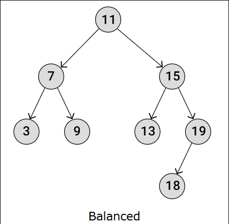
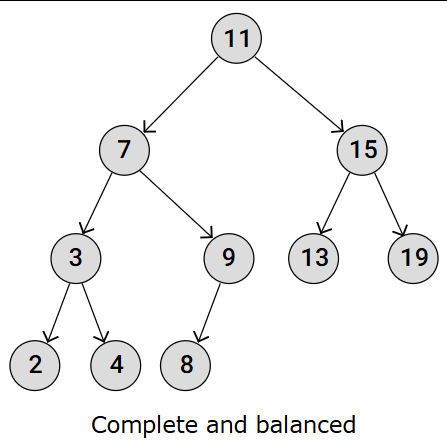
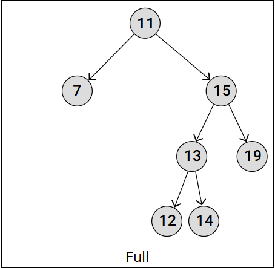
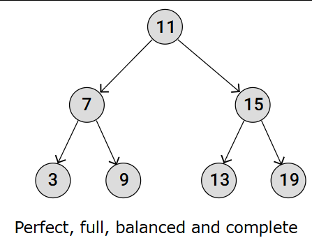

# Trees

## What is a Tree?
A tree in DSA (Data Structures and Algorithms) is a way to organize data. It looks like an upside-down tree with a root at the top and branches spreading out. Each point on the tree is called a node, and the lines connecting them are called edges. The top node is the root, and nodes with no children are called leaves.

The basic idea of a tree is to show a hierarchy. 



For example, a family tree shows how family members are related. Trees help us organize and find data quickly. They are important because they make searching, sorting, and organizing data more efficient. 

Tree data structures are used in many applications like databases, file systems, and even in games to make decisions. Understanding trees helps us solve problems faster and manage data better.


## Properties
- Number of edges: An edge can be defined as the connection between two nodes. If a tree has N nodes then it will have (N-1) edges.
- Depth of a node: The depth of a node is defined as the length of the path from the root to that node. Each edge adds 1 unit of length to the path. So, it can also be defined as the number of edges in the path from the root of the tree to the node.
- Height of a node: The height of a node can be defined as the length of the longest path from the node to a leaf node of the tree.
- Height of the Tree: The height of a tree is the length of the longest path from the root of the tree to a leaf node of the tree.
- Degree of a Node: The total count of subtrees attached to that node is called the degree of the node. The degree of a tree is the maximum degree of a node among all the nodes in the tree.


## Types of trees 
- Binary Trees: Each node has up to two children, the left child node and the right child node. This structure is the foundation for more complex tree types like Binary Search Trees and AVL Trees.
- Binary Search Trees (BSTs): A type of Binary Tree where for each node, the left child node has a lower value, and the right child node has a higher value.
- AVL Trees: A type of Binary Search Tree that self-balances so that for every node, the difference in height between the left and right subtrees is at most one. This balance is maintained through rotations when nodes are inserted or deleted.

We will mainly discuss Binary Trees and Binary Search Trees:

# Binary Trees
A binary tree in DSA (Data Structures and Algorithms) is a way to organize data in a hierarchical structure. In a binary tree, each node has at most two children, called the left child and the right child. The topmost node is called the root, and the nodes with no children are called leaves.

The basic idea of a binary tree is to have a parent-child relationship between nodes. Each node can have a left and a right child, and this pattern continues down the tree. This structure makes it easy to organize and find data quickly.



## Types of Binary Trees:
- A balanced Binary Tree has at most 1 in difference between its left and right subtree heights, for each node in the tree.



- A complete Binary Tree has all levels full of nodes, except the last level, which is can also be full, or filled from left to right. The properties of a complete Binary Tree means it is also balanced.



- A full Binary Tree is a kind of tree where each node has either 0 or 2 child nodes.



- A perfect Binary Tree has all leaf nodes on the same level, which means that all levels are full of nodes, and all internal nodes have two child nodes.The properties of a perfect Binary Tree means it is also full, balanced, and complete.



## Binary Tree Implementation 
Declaring a node of a Binary Tree:
- In C++ :
```cpp
// Use any below method to implement Nodes of binary tree

// 1: Using struct
struct Node {
    int data;
    Node* left, * right;

    Node(int key) {
        data = key;
        left = nullptr;
        right = nullptr;
    }
};

// 2: Using class
class Node {
public:
    int data;
    Node* left, * right;

    Node(int key) {
        data = key;
        left = nullptr;
        right = nullptr;
    }
};
```
- In Python:
```python
# A Python class that represents
# an individual node in a Binary Tree
class Node:
    def __init__(self, key):
        self.left = None
        self.right = None
        self.val = key
```
- In Javascript:
```javascript
/* Class containing left and right child 
  of current node and data*/

class Node
{
    constructor(item)
    {
        this.data = item;
        this.left = this.right = null;
    }
}
```
Here is an example in C++ for creating a Binary tree with four nodes:


```cpp
#include <iostream>
using namespace std;

struct Node{
    int data;
    Node *left, *right;
    Node(int d){
        data = d;
        left = nullptr;
        right = nullptr;
    }
};

int main(){
    // Initilize and allocate memory for tree nodes
    Node* firstNode = new Node(2);
    Node* secondNode = new Node(3);
    Node* thirdNode = new Node(4);
    Node* fourthNode = new Node(5);

    // Connect binary tree nodes
    firstNode->left = secondNode;
    firstNode->right = thirdNode;
    secondNode->left = fourthNode;
    return 0;
}
```
- After creating three nodes, we have connected these node to form the tree structure like mentioned in above image.
- Connect the secondNode to the left of firstNode by firstNode->left = secondNode
- Connect the thirdNode to the right of firstNode by firstNode->right = thirdNode
- Connect the fourthNode to the left of secondNode by secondNode->left = fourthNode

# Binary Tree Traversals

Binary tree traversal refers to the process of visiting each node in a binary tree exactly once in a specific order. There are mainly **two types** of traversal:

- **Depth-First Traversal** (Inorder, Preorder, Postorder)
- **Breadth-First Traversal** (Level Order)

## 1. Inorder Traversal (Left → Root → Right)

In an inorder traversal, the nodes are recursively visited in this order:
**left subtree → root → right subtree**

```cpp
void inorder(Node* node) {
    if (node == nullptr)
        return;
    inorder(node->left);
    cout << node->data << " ";
    inorder(node->right);
}
```
You can view the animation for this traversal here : 
https://www.w3schools.com/dsa/dsa_algo_binarytrees_inorder.php

---

## 2. Preorder Traversal (Root → Left → Right)

In a preorder traversal, the nodes are visited in the order:
**root → left subtree → right subtree**

```cpp
void preorder(Node* root) {
    if (root == nullptr)
        return;
    cout << root->data << " ";
    preorder(root->left);
    preorder(root->right);
}
```

---

## 3. Postorder Traversal (Left → Right → Root)

In a postorder traversal, the nodes are visited in the order:
**left subtree → right subtree → root**

```cpp
void postorder(Node* root) {
    if (root == nullptr)
        return;
    postorder(root->left);
    postorder(root->right);
    cout << root->data << " ";
}
```

---

## 4. Level Order Traversal (Breadth-First)

In level order traversal, nodes are visited level by level using a queue.

```cpp
void levelOrder(Node* root) {
    if (root == nullptr)
        return;

    queue<Node*> q;
    q.push(root);

    while (!q.empty()) {
        Node* curr = q.front();
        q.pop();
        cout << curr->data << " ";

        if (curr->left != nullptr)
            q.push(curr->left);
        if (curr->right != nullptr)
            q.push(curr->right);
    }
}
```

---

## Example Usage

```cpp
int main() {
    Node* root = new Node(1);
    root->left = new Node(2);
    root->right = new Node(3);
    root->left->left = new Node(4);
    root->left->right = new Node(5);

    cout << "Inorder: ";
    inorder(root);
    cout << "\nPreorder: ";
    preorder(root);
    cout << "\nPostorder: ";
    postorder(root);
    cout << "\nLevel Order: ";
    levelOrder(root);
}
```

---

## Output

```
Inorder: 4 2 5 1 3
Preorder: 1 2 4 5 3
Postorder: 4 5 2 3 1
Level Order: 1 2 3 4 5
```

# Operations 

In this section, we look at how to perform **insertion** and **deletion** operations in a Binary Tree .

---

## Node Structure

```cpp
struct Node {
    int data;
    Node* left;
    Node* right;

    Node(int val) {
        data = val;
        left = nullptr;
        right = nullptr;
    }
};
```

---

## Insertion

To insert a node, we perform a **level order traversal** and place the new node at the first available position.

```cpp
void insert(Node* root, int key) {
    if (!root) return;

    queue<Node*> q;
    q.push(root);

    while (!q.empty()) {
        Node* temp = q.front();
        q.pop();

        if (!temp->left) {
            temp->left = new Node(key);
            return;
        } else {
            q.push(temp->left);
        }

        if (!temp->right) {
            temp->right = new Node(key);
            return;
        } else {
            q.push(temp->right);
        }
    }
}
```

---

## Deletion

To delete a node:
1. We find the node with the given key.
2. We replace its value with the value of the **deepest rightmost node**.
3. Then, we delete the deepest node.

```cpp
void deleteDeepest(Node* root, Node* d_node) {
    queue<Node*> q;
    q.push(root);

    while (!q.empty()) {
        Node* temp = q.front();
        q.pop();

        if (temp->left) {
            if (temp->left == d_node) {
                temp->left = nullptr;
                delete d_node;
                return;
            }
            q.push(temp->left);
        }

        if (temp->right) {
            if (temp->right == d_node) {
                temp->right = nullptr;
                delete d_node;
                return;
            }
            q.push(temp->right);
        }
    }
}

void deleteNode(Node* root, int key) {
    if (!root) return;

    queue<Node*> q;
    q.push(root);

    Node* keyNode = nullptr;
    Node* temp;

    while (!q.empty()) {
        temp = q.front();
        q.pop();

        if (temp->data == key)
            keyNode = temp;

        if (temp->left)
            q.push(temp->left);
        if (temp->right)
            q.push(temp->right);
    }

    if (keyNode) {
        int x = temp->data;
        deleteDeepest(root, temp);
        keyNode->data = x;
    }
}
```

---

## Example

```cpp
int main() {
    Node* root = new Node(10);
    root->left = new Node(11);
    root->right = new Node(9);
    root->left->left = new Node(7);
    root->right->left = new Node(15);
    root->right->right = new Node(8);

    insert(root, 12);      // Insert 12
    deleteNode(root, 11);  // Delete node with value 11
}
```

Here are some useful binary tree problems that you can practice:

---

### Easy

- [Same Tree](https://leetcode.com/problems/same-tree/description/) | [Solution](https://www.geeksforgeeks.org/dsa/write-c-code-to-determine-if-two-trees-are-identical/?utm_source=chatgpt.com)
- [Maximum Depth of Binary Tree](https://leetcode.com/problems/maximum-depth-of-binary-tree/description/) | [Solution](https://www.geeksforgeeks.org/dsa/find-the-maximum-depth-or-height-of-a-tree/?utm_source=chatgpt.com)
- [Symmetric Tree](https://leetcode.com/problems/symmetric-tree/description/) | [Solution](https://www.geeksforgeeks.org/dsa/symmetric-tree-tree-which-is-mirror-image-of-itself/?utm_source=chatgpt.com)
- [Diameter of Binary Tree](https://leetcode.com/problems/diameter-of-binary-tree/description/) | [Solution](https://www.geeksforgeeks.org/dsa/diameter-of-a-binary-tree/)
- [Average of Levels in Binary Tree](https://leetcode.com/problems/average-of-levels-in-binary-tree/description/) | [Solution](https://www.geeksforgeeks.org/dsa/averages-levels-binary-tree/)
- [Invert Binary Tree](https://leetcode.com/problems/invert-binary-tree/description/) | [Solution](https://www.geeksforgeeks.org/dsa/write-an-efficient-c-function-to-convert-a-tree-into-its-mirror-tree/?utm_source=chatgpt.com)
- [Root Equals Sum of Children](https://leetcode.com/problems/root-equals-sum-of-children/description/) | [Solution](https://www.geeksforgeeks.org/dsa/check-for-children-sum-property-in-a-binary-tree/?utm_source=chatgpt.com)

---

### Medium

- [Binary Tree Zigzag Level Order Traversal](https://leetcode.com/problems/binary-tree-zigzag-level-order-traversal/description/) | [Solution](https://www.geeksforgeeks.org/dsa/zigzag-tree-traversal/?utm_source=chatgpt.com)
- [Sum Root to Leaf Numbers](https://leetcode.com/problems/sum-root-to-leaf-numbers/description/) | [Solution](https://www.geeksforgeeks.org/dsa/sum-numbers-formed-root-leaf-paths/)
- [Path Sum III](https://leetcode.com/problems/path-sum-iii/description/) | [Solution](https://algo.monster/liteproblems/437)
- [Longest Univalue Path](https://leetcode.com/problems/longest-univalue-path/description/) | [Solution](https://algo.monster/liteproblems/687)
- [Construct Binary Tree from Preorder and Inorder Traversal](https://leetcode.com/problems/construct-binary-tree-from-preorder-and-inorder-traversal/description/) | [Solution](https://www.geeksforgeeks.org/dsa/construct-tree-from-given-inorder-and-preorder-traversal/)

---

### Hard
- [Binary Tree Maximum Path Sum](https://leetcode.com/problems/binary-tree-maximum-path-sum/description/) | [Solution](https://www.geeksforgeeks.org/dsa/find-maximum-path-sum-in-a-binary-tree/)
- [Binary Tree Cameras](https://leetcode.com/problems/binary-tree-cameras/description/) | [Solution](https://www.geeksforgeeks.org/dsa/minimum-number-of-cameras-required-to-monitor-all-nodes-of-a-binary-tree/)
- [Height of Binary Tree After Subtree Removal Queries](https://leetcode.com/problems/height-of-binary-tree-after-subtree-removal-queries/description/) | [Solution](https://algo.monster/liteproblems/2458)


