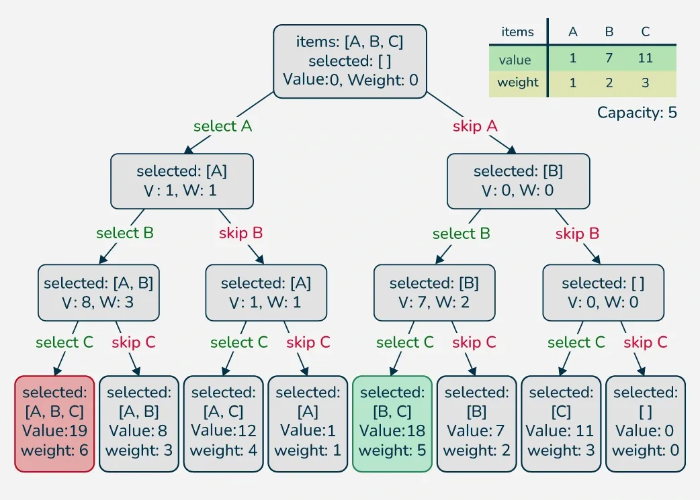

# 0/1 Knapsack Problem

Given n items where each item has some weight and profit associated with it and also given a bag with capacity W, [i.e., the bag can hold at most W weight in it]. The task is to put the items into the bag such that the sum of profits associated with them is the maximum possible. 

**Note:** The constraint here is we can either put an item completely into the bag or cannot put it at all [It is not possible to put a part of an item into the bag].

---

## Naive approach using Recursion
**Time complexity:** O(2^n)  
**Space complexity:** O(n)  
The maximum value obtained from 'n' items is the max of the following two values. 

- Case 1 (pick the nth item): Value of the nth item + maximum value obtained by remaining (n-1) items and remaining weight i.e. (W-weight of the nth item).
- Case 2 (don't pick the nth item): Maximum value obtained by (n-1) items and W weight.
- If the weight of the 'nth' item is greater than 'W', then the nth item cannot be included and Case 2 is the only possibility.

Here is an illustration of the implementation. 


### C++
```cpp
#include <bits/stdc++.h>
using namespace std;

// Returns the maximum value that
// can be put in a knapsack of capacity W
int knapsackRec(int W, vector<int> &val, vector<int> &wt, int n) {

    // Base Case
    if (n == 0 || W == 0)
        return 0;

    int pick = 0;

    // Pick nth item if it does not exceed the capacity of knapsack
    if (wt[n - 1] <= W)
        pick = val[n - 1] + knapsackRec(W - wt[n - 1], val, wt, n - 1);
    
    // Don't pick the nth item
    int notPick = knapsackRec(W, val, wt, n - 1);
     
    return max(pick, notPick);
}

int knapsack(int W, vector<int> &val, vector<int> &wt) {
    int n = val.size();
    return knapsackRec(W, val, wt, n);
}

int main() {
    vector<int> val = {1, 2, 3};
    vector<int> wt = {4, 5, 1};
    int W = 4;

    cout << knapsack(W, val, wt) << endl;
    return 0;
}
```

### Python
```python
# Returns the maximum value that
# can be put in a knapsack of capacity W
def knapsackRec(W, val, wt, n):

    # Base Case
    if n == 0 or W == 0:
        return 0

    pick = 0

    # Pick nth item if it does not exceed the capacity of knapsack
    if wt[n - 1] <= W:
        pick = val[n - 1] + knapsackRec(W - wt[n - 1], val, wt, n - 1)
    
    # Don't pick the nth item
    notPick = knapsackRec(W, val, wt, n - 1)
     
    return max(pick, notPick)

def knapsack(W, val, wt):
    n = len(val)
    return knapsackRec(W, val, wt, n)

if __name__ == "__main__":
    val = [1, 2, 3]
    wt = [4, 5, 1]
    W = 4

    print(knapsack(W, val, wt))
```

### Javascript
```javascript
// Returns the maximum value that
// can be put in a knapsack of capacity W
function knapsackRec(W, val, wt, n) {

    // Base Case
    if (n === 0 || W === 0)
        return 0;

    let pick = 0;

    // Pick nth item if it does not exceed the capacity of knapsack
    if (wt[n - 1] <= W)
        pick = val[n - 1] + knapsackRec(W - wt[n - 1], val, wt, n - 1);
    
    // Don't pick the nth item
    let notPick = knapsackRec(W, val, wt, n - 1);
     
    return Math.max(pick, notPick);
}

function knapsack(W, val, wt) {
    let n = val.length;
    return knapsackRec(W, val, wt, n);
}


// Driver Code
let val = [1, 2, 3];
let wt = [4, 5, 1];
let W = 4;

console.log(knapsack(W, val, wt));
```

---

## Using Memoization
**Time complexity:** O(n x W)  
**Space complexity:** O(n x W)  
Using the previous approach, but implementing memoization. If we get a subproblem the first time, we can solve this problem by creating a 2-D array that can store a particular state (n, w). Now if we come across the same state (n, w) again instead of calculating it i again we can directly return its result stored in the table in constant time.

### C++
```cpp
#include <bits/stdc++.h>
using namespace std;

// Returns the maximum value that
// can be put in a knapsack of capacity W
int knapsackRec(int W, vector<int> &val, vector<int> &wt, int n, 
                                        vector<vector<int>> &memo) {

    // Base Case
    if (n == 0 || W == 0)
        return 0;

    // Check if we have previously calculated the same subproblem
    if(memo[n][W] != -1)
        return memo[n][W];

    int pick = 0;

    // Pick nth item if it does not exceed the capacity of knapsack
    if (wt[n - 1] <= W)
        pick = val[n - 1] + knapsackRec(W - wt[n - 1], val, wt, n - 1, memo);
    
    // Don't pick the nth item
    int notPick = knapsackRec(W, val, wt, n - 1, memo);
    
    // Store the result in memo[n][W] and return it
    return memo[n][W] = max(pick, notPick);
}

int knapsack(int W, vector<int> &val, vector<int> &wt) {
    int n = val.size();
    
    // Memoization table to store the results
    vector<vector<int>> memo(n + 1, vector<int>(W + 1, -1));
    
    return knapsackRec(W, val, wt, n, memo);
}

int main() {
    vector<int> val = {1, 2, 3};
    vector<int> wt = {4, 5, 1};
    int W = 4;

    cout << knapsack(W, val, wt) << endl;
    return 0;
}
```

### Python
```python
# Returns the maximum value that
# can be put in a knapsack of capacity W
def knapsackRec(W, val, wt, n, memo):

    # Base Case
    if n == 0 or W == 0:
        return 0

    # Check if we have previously calculated the same subproblem
    if memo[n][W] != -1:
        return memo[n][W]

    pick = 0

    # Pick nth item if it does not exceed the capacity of knapsack
    if wt[n - 1] <= W:
        pick = val[n - 1] + knapsackRec(W - wt[n - 1], val, wt, n - 1, memo)

    # Don't pick the nth item
    notPick = knapsackRec(W, val, wt, n - 1, memo)

    # Store the result in memo[n][W] and return it
    memo[n][W] = max(pick, notPick)
    return memo[n][W]

def knapsack(W, val, wt):
    n = len(val)

    # Memoization table to store the results
    memo = [[-1] * (W + 1) for _ in range(n + 1)]

    return knapsackRec(W, val, wt, n, memo)

if __name__ == "__main__":
    val = [1, 2, 3]
    wt = [4, 5, 1]
    W = 4

    print(knapsack(W, val, wt))
```

### Javascript
```javascript
// Returns the maximum value that
// can be put in a knapsack of capacity W
function knapsackRec(W, val, wt, n, memo) {

    // Base Case
    if (n === 0 || W === 0)
        return 0;

    // Check if we have previously calculated the same subproblem
    if (memo[n][W] !== -1)
        return memo[n][W];

    let pick = 0;

    // Pick nth item if it does not exceed the capacity of knapsack
    if (wt[n - 1] <= W)
        pick = val[n - 1] + knapsackRec(W - wt[n - 1], val, wt, n - 1, memo);

    // Don't pick the nth item
    let notPick = knapsackRec(W, val, wt, n - 1, memo);

    // Store the result in memo[n][W] and return it
    memo[n][W] = Math.max(pick, notPick);
    return memo[n][W];
}

function knapsack(W, val, wt) {
    const n = val.length;

    // Memoization table to store the results
    const memo = Array.from({ length: n + 1 }, () => Array(W + 1).fill(-1));

    return knapsackRec(W, val, wt, n, memo);
}

// Driver Code
const val = [1, 2, 3];
const wt = [4, 5, 1];
const W = 4;

console.log(knapsack(W, val, wt));
```

---

## Using Tabulation
**Time complexity:** O(n x W)  
**Space complexity:** O(W)  
There are two parameters that change in the recursive solution and these parameters go from 0 to n and 0 to W. So we create a 2D dp[][] array of size (n+1) x (W+1), such that dp[i][j] stores the maximum value we can get using i items such that the knapsack capacity is j.

- We first fill the known entries when m is 0 or n is 0.
- Then we fill the remaining entries using the recursive formula.
For each item i and knapsack capacity j, we decide whether to pick the item or not.

- If we don't pick the item: dp[i][j] remains same as the previous item, that is dp[i - 1][j].
- If we pick the item: dp[i][j] is updated to val[i] + dp[i - 1][j - wt[i]].
- 
### C++
```cpp
#include <bits/stdc++.h>
using namespace std;

// Returns the maximum value that
// can be put in a knapsack of capacity W
int knapsack(int W, vector<int> &val, vector<int> &wt) {
    int n = wt.size();
    vector<vector<int>> dp(n + 1, vector<int>(W + 1));

    // Build table dp[][] in bottom-up manner
    for (int i = 0; i <= n; i++) {
        for (int j = 0; j <= W; j++) {
            
            // If there is no item or the knapsack's capacity is 0
            if (i == 0 || j == 0)
                dp[i][j] = 0;
            else {
                int pick = 0;
                
                // Pick ith item if it does not exceed the capacity of knapsack
                if(wt[i - 1] <= j)
                    pick = val[i - 1] + dp[i - 1][j - wt[i - 1]];
                    
                // Don't pick the ith item
                int notPick = dp[i - 1][j];
                
                dp[i][j] = max(pick, notPick);
            }
        }
    }
    return dp[n][W];
}

int main() {
    vector<int> val = {1, 2, 3};
    vector<int> wt = {4, 5, 1};
    int W = 4;

    cout << knapsack(W, val, wt) << endl;
    return 0;
}
```

### Python
```python
def knapsack(W, val, wt):
    n = len(wt)
    dp = [[0 for _ in range(W + 1)] for _ in range(n + 1)]

    # Build table dp[][] in bottom-up manner
    for i in range(n + 1):
        for j in range(W + 1):

            # If there is no item or the knapsack's capacity is 0
            if i == 0 or j == 0:
                dp[i][j] = 0
            else:
                pick = 0

                # Pick ith item if it does not exceed the capacity of knapsack
                if wt[i - 1] <= j:
                    pick = val[i - 1] + dp[i - 1][j - wt[i - 1]]

                # Don't pick the ith item
                notPick = dp[i - 1][j]

                dp[i][j] = max(pick, notPick)

    return dp[n][W]

if __name__ == "__main__":
    val = [1, 2, 3]
    wt = [4, 5, 1]
    W = 4
    
    print(knapsack(W, val, wt))
```

### Javascript
```javascript
// Returns the maximum value that
// can be put in a knapsack of capacity W

function knapsack(W, val, wt) {
    let n = wt.length;
    let dp = Array.from({ length: n + 1 }, () => Array(W + 1).fill(0));

    // Build table dp[][] in bottom-up manner
    for (let i = 0; i <= n; i++) {
        for (let j = 0; j <= W; j++) {

            // If there is no item or the knapsack's capacity is 0
            if (i === 0 || j === 0)
                dp[i][j] = 0;
            else {
                let pick = 0;

                // Pick ith item if it does not exceed the capacity of knapsack
                if (wt[i - 1] <= j)
                    pick = val[i - 1] + dp[i - 1][j - wt[i - 1]];

                // Don't pick the ith item
                let notPick = dp[i - 1][j];

                dp[i][j] = Math.max(pick, notPick);
            }
        }
    }
    return dp[n][W];
}

// Driver code
let val = [1, 2, 3];
let wt = [4, 5, 1];
let W = 4;

console.log(knapsack(W, val, wt));
```

---

## Using Space Optimized DP
**Time complexity:** O(n x W)  
**Space complexity:** O(n x W)  
For calculating the current row of the dp[] array we require only previous row, but if we start traversing the rows from right to left then it can be done with a single row only.

### C++
```cpp
#include <bits/stdc++.h>
using namespace std;

// Function to find the maximum profit
int knapsack(int W, vector<int> &val, vector<int> &wt) {

    // Initializing dp vector
    vector<int> dp(W + 1, 0);

    // Taking first i elements
    for (int i = 1; i <= wt.size(); i++) {
        
        // Starting from back, so that we also have data of
        // previous computation of i-1 items
        for (int j = W; j >= wt[i - 1]; j--) {
            dp[j] = max(dp[j], dp[j - wt[i - 1]] + val[i - 1]);
        }
    }
    return dp[W];
}

int main() {
    vector<int> val = {1, 2, 3};
    vector<int> wt = {4, 5, 1};
    int W = 4;

    cout << knapsack(W, val, wt) << endl;
    return 0;
}
```

### Python
```python
# Function to find the maximum profit
def knapsack(W, val, wt):
    
    # Initializing dp list
    dp = [0] * (W + 1)

    # Taking first i elements
    for i in range(1, len(wt) + 1):
        
        # Starting from back, so that we also have data of
        # previous computation of i-1 items
        for j in range(W, wt[i - 1] - 1, -1):
            dp[j] = max(dp[j], dp[j - wt[i - 1]] + val[i - 1])
    
    return dp[W]

if __name__ == "__main__":
    val = [1, 2, 3]
    wt = [4, 5, 1]
    W = 4

    print(knapsack(W, val, wt))
```

### Javascript
```javascript
// Function to find the maximum profit
function knapsack(W, val, wt) {

    // Initializing dp array
    let dp = new Array(W + 1).fill(0);

    // Taking first i elements
    for (let i = 1; i <= wt.length; i++) {
        
        // Starting from back, so that we also have data of
        // previous computation of i-1 items
        for (let j = W; j >= wt[i - 1]; j--) {
            dp[j] = Math.max(dp[j], dp[j - wt[i - 1]] + val[i - 1]);
        }
    }
    return dp[W];
}

// Driver Code
let val = [1, 2, 3];
let wt = [4, 5, 1];
let W = 4;

console.log(knapsack(W, val, wt));
```
