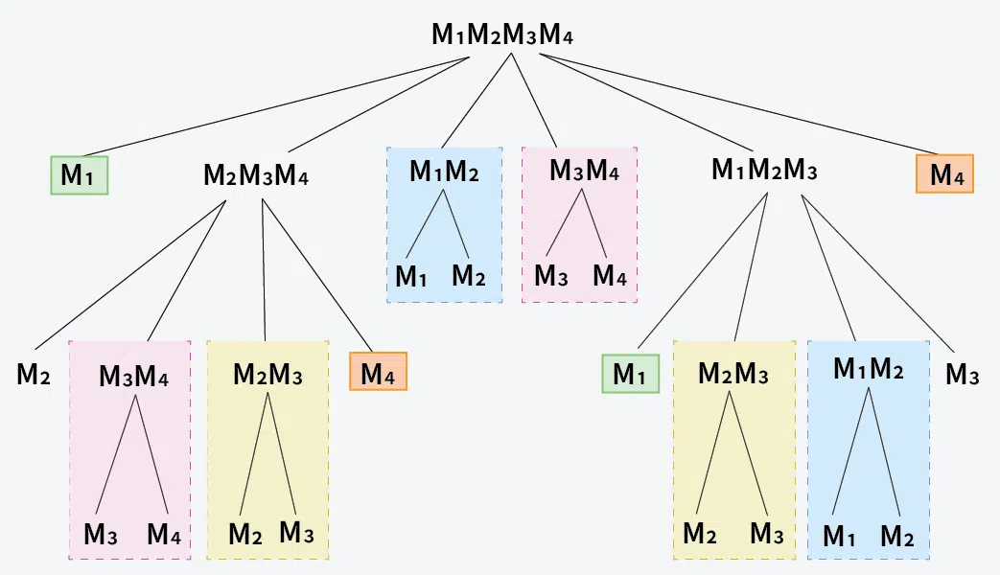

# Matrix Chain Multiplication

Given the dimension of a sequence of matrices in an array arr[], where the dimension of the ith matrix is (arr[i-1] * arr[i]), the task is to find the most efficient way to multiply these matrices together such that the total number of element multiplications is minimum. When two matrices of size m*n and n*p when multiplied, they generate a matrix of size m*p and the number of multiplications performed is m*n*p.

## Naive Approach using Recursion
**Time complexity:** O(2^n)  
**Space complexity:** O(n)  
Now, for a given chain of n matrices, the first partition can be done in n-1 ways. For example, sequence of matrices M1, M2, M3 and M4 can be grouped as (M1)(M2 x M3 x M4), (M1x M2) x (M3 x M4) or ((M1 x M2 x M3) x M4) in these 3 ways. 

For n matrices M1, M2, ..... Mn. we can put the first bracket n-1 ways

(M1) x (M2 x M3 x M4 ......... Mn-1 x Mn)  
(M1 x M2) x (M3 x M4.......... Mn-1 x Mn)  
(M1 x M2 x M3) x (M4 .......... Mn-1 x Mn)  
..............................................................................  
..............................................................................  
(M1 x M2 x M3 x M4 ..........Mn-1) x (Mn)  
We put the first bracket at different n-1 places and then recursively call for the two parts. At the end, we return the minimum of all partitions.

To write a recursive function we use a range of indexes [i, j].  And run a loop for k = i + 1 to j.  For k = i + 1, we put the first bracket after the first matrix which has dimensions arr[i] x arr[i+1] and before the remaining matrices which have dimensions arr[i+1] x arr[i+2],  arr[i+2] x arr[i+3], ........... arr[j-1] x arr[j]    

- For every k, we make two subproblems : (a) Chain from i to k  (b) Chain from k to j
- Each of the subproblems can be further partitioned into smaller subproblems and we can find the total required multiplications by solving for each of the groups.
- The base case would be when we have only one matrix left which means when j is equal to i+1.

### C++
```cpp
// C++ code to implement the
// matrix chain multiplication using recursion
#include <bits/stdc++.h>
using namespace std;

// Matrix Ai has dimension arr[i-1] x arr[i]
int minMultRec(vector<int> &arr, int i, int j)
{

    // If there is only one matrix
    if (i + 1 == j)
        return 0;

    int res = INT_MAX;

    // Place the first bracket at different
    // positions or k and for every placed
    // first bracket, recursively compute
    // minimum cost for remaining brackets
    // (or subproblems)
    for (int k = i + 1; k < j; k++)
    {
        int curr = minMultRec(arr, i, k) + minMultRec(arr, k, j) + arr[i] * arr[k] * arr[j];

        res = min(curr, res);
    }

    // Return minimum count
    return res;
}

int matrixMultiplication(vector<int> &arr)
{

    int n = arr.size();
    return minMultRec(arr, 0, n - 1);
}

int main()
{

    vector<int> arr = {2, 1, 3, 4};
    cout << matrixMultiplication(arr);
    return 0;
}
```

### Python
```python
# Python code to implement the
# matrix chain multiplication using recursion
import sys

# Matrix Ai has dimension arr[i-1] x arr[i]


def minMultRec(arr, i, j):

    # If there is only one matrix
    if i + 1 == j:
        return 0

    res = sys.maxsize

    # Place the first bracket at different
    # positions or k and for every placed
    # first bracket, recursively compute
    # minimum cost for remaining brackets
    # (or subproblems)
    for k in range(i + 1, j):
        curr = minMultRec(arr, i, k) \
            + minMultRec(arr, k, j) \
            + arr[i] * arr[k] * arr[j]

        res = min(curr, res)

    # Return minimum count
    return res


def matrixMultiplication(arr):
    n = len(arr)
    return minMultRec(arr, 0, n - 1)


if __name__ == "__main__":
    arr = [2, 1, 3, 4]
    res = matrixMultiplication(arr)
    print(res)
```

### Javascript
```javascript
// JavaScript code to implement the
// matrix chain multiplication using recursion
function minMultRec(arr, i, j)
{

    // If there is only one matrix
    if (i + 1 === j)
        return 0;

    let res = Number.MAX_SAFE_INTEGER;

    // Place the first bracket at different
    // positions or k and for every placed
    // first bracket, recursively compute
    // minimum cost for remaining brackets
    // (or subproblems)
    for (let k = i + 1; k < j; k++) {
        let curr = minMultRec(arr, i, k)
                   + minMultRec(arr, k, j)
                   + arr[i] * arr[k] * arr[j];

        res = Math.min(curr, res);
    }

    // Return minimum count
    return res;
}

function matrixMultiplication(arr)
{

    const n = arr.length;
    return minMultRec(arr, 0, n - 1);
}

let arr = [ 2, 1, 3, 4 ];
let res = matrixMultiplication(arr);
console.log(res);
```

---

## Using Memoization
**Time complexity:** O(n^3)  
**Space complexity:** O(n^2)  
Let's suppose we have four matrices (M1, M2, M3, M4). Based on the recursive approach described above, we can construct a recursion tree. However, we can observe that some problems are computed multiple times. To avoid this redundant computation, we can implement memoization to store the results of previously computed inputs.



- Build a matrix memo[][] of size n*n for memoization purposes.
- Use the same recursive call as done in the above approach:
- When we find a range (i, j) for which the value is already calculated, return the minimum value for that range (i.e., memo[i][j]).
- Otherwise, perform the recursive calls as mentioned earlier.
- The value stored at memo[0][n-1] is the required answer.

### C++
```cpp
// C++ code to implement the
// matrix chain multiplication using memoization
#include <bits/stdc++.h>
using namespace std;

int minMultRec(vector<int> &arr, int i, int j, vector<vector<int>> &memo)
{

    // If there is only one matrix
    if (i + 1 == j)
        return 0;

    // Check if the result is already
    // computed
    if (memo[i][j] != -1)
        return memo[i][j];

    int res = INT_MAX;

    // Place the first bracket at different positions or k and
    // for every placed first bracket, recursively compute
    // minimum cost for remaining brackets (or subproblems)
    for (int k = i + 1; k < j; k++)
    {
        int curr = minMultRec(arr, i, k, memo) + minMultRec(arr, k, j, memo) + arr[i] * arr[k] * arr[j];

        res = min(curr, res);
    }

    // Store the result in memo table
    memo[i][j] = res;
    return res;
}

int matrixMultiplication(vector<int> &arr)
{

    int n = arr.size();
    vector<vector<int>> memo(n, vector<int>(n, -1));
    return minMultRec(arr, 0, n - 1, memo);
}

int main()
{
    vector<int> arr = {2, 1, 3, 4};
    int res = matrixMultiplication(arr);
    cout << res << endl;
    return 0;
}
```

### Python
```python
# Python code to implement the
# matrix chain multiplication using memoization
import sys

# Function to compute minimum multiplication
# recursively


def minMultRec(arr, i, j, memo):

    # If there is only one matrix
    if i + 1 == j:
        return 0

    # Check if the result is already computed
    if memo[i][j] != -1:
        return memo[i][j]

    res = sys.maxsize

    # Place the first bracket at different positions or k
    # and for every placed first bracket, recursively compute
    # minimum cost for remaining brackets (or subproblems)
    for k in range(i + 1, j):
        curr = (minMultRec(arr, i, k, memo) +
                minMultRec(arr, k, j, memo) +
                arr[i] * arr[k] * arr[j])
        res = min(res, curr)

    # Store the result in memo table
    memo[i][j] = res
    return res


def matrixMultiplication(arr):
    n = len(arr)
    memo = [[-1 for _ in range(n)] for _ in range(n)]
    return minMultRec(arr, 0, n - 1, memo)


if __name__ == "__main__":
    arr = [2, 1, 3, 4]
    res = matrixMultiplication(arr)
    print(res)
```

### Javascript
```javascript
// JavaScript code to implement the
// matrix chain multiplication using memoization

function minMultRec(arr, i, j, memo)
{

    // If there is only one matrix
    if (i + 1 === j)
        return 0;

    // Check if the result is already computed
    if (memo[i][j] !== -1)
        return memo[i][j];

    let res = Number.MAX_SAFE_INTEGER;

    // Place the first bracket at different positions or k
    // and for every placed first bracket, recursively
    // compute minimum cost for remaining brackets (or
    // subproblems)
    for (let k = i + 1; k < j; k++) {
        let curr = minMultRec(arr, i, k, memo)
                   + minMultRec(arr, k, j, memo)
                   + arr[i] * arr[k] * arr[j];

        res = Math.min(res, curr);
    }

    // Store the result in memo table
    memo[i][j] = res;
    return res;
}

function matrixMultiplication(arr)
{

    let n = arr.length;
    let memo
        = Array.from({length : n}, () => Array(n).fill(-1));
    return minMultRec(arr, 0, n - 1, memo);
}

let arr = [ 2, 1, 3, 4 ];
let res = matrixMultiplication(arr);
console.log(res);
```

---

## Using Tabulation
**Time complexity:** O(n^3)  
**Space complexity:** O(n^2)  
In iterative approach, we initially need to find the number of multiplications required to multiply two adjacent matrices. We can use these values to find the minimum multiplication required for matrices in a range of length 3 and further use those values for ranges with higher length. 

The iterative implementation is going to be tricky here we initially know diagonal values (which are 0), our result is going to be at the top right corner (or dp[0][n-1]) and we never access lower diagonal values. So we cannot fill the matrix with a normal traversal, we rather need to fill in diagonal manner. We fill the matrix using a variable len that stores differences between row and column indexes. We keep increasing len until it becomes n-1 (for the top right element)

### C++
```cpp
// C++ code to implement the
// matrix chain multiplication using tabulation
#include <bits/stdc++.h>
using namespace std;

int matrixMultiplication(vector<int> &arr)
{

    int n = arr.size();

    // Create a 2D DP array to store the minimum
    // multiplication costs
    vector<vector<int>> dp(n, vector<int>(n, 0));

    // Fill the DP array.
    // Here, len is the chain length
    for (int len = 2; len < n; len++)
    {
        for (int i = 0; i < n - len; i++)
        {
            int j = i + len;
            dp[i][j] = INT_MAX;

            for (int k = i + 1; k < j; k++)
            {
                int cost = dp[i][k] + dp[k][j] + arr[i] * arr[k] * arr[j];
                dp[i][j] = min(dp[i][j], cost);
            }
        }
    }

    // The minimum cost is stored in dp[0][n-1]
    return dp[0][n - 1];
}

int main()
{

    vector<int> arr = {2, 1, 3, 4};
    cout << matrixMultiplication(arr);
    return 0;
}
```

### Python
```python
# Python code to implement the
# matrix chain multiplication using tabulation

def matrixMultiplication(arr):
    n = len(arr)

    # Create a 2D DP array to store min
    # multiplication costs
    dp = [[0] * n for _ in range(n)]

    # Fill the DP array
    # length is the chain length
    for length in range(2, n):
        for i in range(n - length):
            j = i + length
            dp[i][j] = float('inf')

            for k in range(i + 1, j):
                cost = dp[i][k] + dp[k][j] + arr[i] * arr[k] * arr[j]
                dp[i][j] = min(dp[i][j], cost)

    # Minimum cost is in dp[0][n-1]
    return dp[0][n - 1]


arr = [2, 1, 3, 4]
print(matrixMultiplication(arr))
```

### Javascript
```javascript
// JavaScript code to implement the
// matrix chain multiplication using tabulation
function matrixMultiplication(arr)
{

    const n = arr.length;

    // Create a 2D DP array to store min
    // multiplication costs
    const dp
        = Array.from({length : n}, () => Array(n).fill(0));

    // Fill the DP array
    // len is the chain length
    for (let len = 2; len < n; len++) {
        for (let i = 0; i < n - len; i++) {
            let j = i + len;
            dp[i][j] = Infinity;

            for (let k = i + 1; k < j; k++) {
                let cost = dp[i][k] + dp[k][j]
                           + arr[i] * arr[k] * arr[j];
                dp[i][j] = Math.min(dp[i][j], cost);
            }
        }
    }

    // Minimum cost is in dp[0][n-1]
    return dp[0][n - 1];
}

const arr = [ 2, 1, 3, 4 ];
console.log(matrixMultiplication(arr));
```

---

